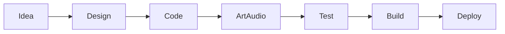

# Apa itu Game Development?

## Learning Objectives

Setelah lesson ini user mampu:

- Menjelaskan 5 disiplin game dev (design, programming, art, audio, UI/UX)
- Menggambarkan pipeline ide → build → deploy
- Memilih peran awal yang mau ditekuni

## Concept

Game Development = membuat **sistem interaktif**: input pemain mengubah state, state di-render jadi gambar/suara, diulang 60x/detik. Bukan sekadar coding — melainkan desain pengalaman + teknik + aset.

## Why It Matters

Pemula gagal karena langsung coding tanpa paham sistem. Paham peta besar menghemat minggu debugging salah arah.

## Visual Explanation



## Example

Pong punya: 2 paddle (entity), bola (physics), skor (UI), bunyi beep (SFX), win-rule (design). 50 baris kode pun tetap mencakup semua disiplin.

```ts
// inti Pong: state + update + render
let ball = { x: 400, y: 300, vx: 200, vy: 150, score: [0,0] };
```

## AI Coding with OpenCode

Gunakan AI untuk membuat GDD mini dulu, bukan langsung kode. Minta AI bertanya balik jika brief kurang jelas.

## Example Prompt

```text
You are a senior game developer.
Context: Saya pemula, mau buat Pong web (HTML Canvas + TS).
Task: Buatkan GDD 1 halaman: core loop, rules, win/lose, scope MVP.
Constraints: Maks 1 level, tanpa multiplayer.
Acceptance Criteria: Ada core loop diagram + 5 rules + daftar fitur MVP vs later.
```

## Practical Exercise

Tulis GDD 1 paragraf untuk game impianmu: core loop + 3 rules + kondisi menang/kalah.

## Challenge

Potong scope game impianmu jadi versi 1-minggu (hapus 70% fitur, sisakan 1 core loop).

## Common Mistakes

- Langsung install engine tanpa desain.
- Scope MMORPG untuk game pertama.
- Copy-paste kode tanpa paham state.

## Debugging

Masalah: "Tidak tahu mulai dari mana." → Solusi: tulis GDD 5 baris dulu, baru tanya AI untuk technical plan.

## Summary

Game dev = sistem (design + code + art + audio + UI) yang diulang lewat game loop. Mulai dari desain kecil.

## Next Lesson

→ `02-game-loop.md` — Game Loop: jantung setiap game.
