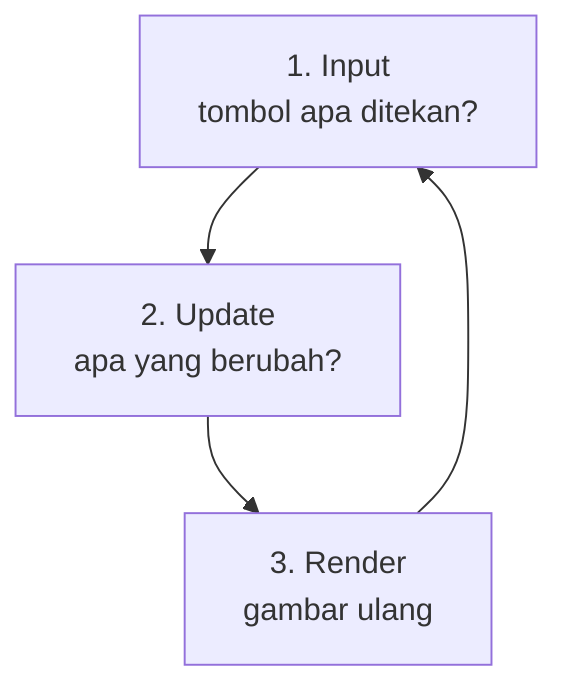

# Game Loop

## Learning Objectives

Setelah lesson ini user mampu:

- Menjelaskan game loop dengan kata sendiri (input → update → gambar)
- Membuat loop sederhana dengan `requestAnimationFrame`
- Mengetahui istilah delta time (detail penuh di lesson khusus)

## Concept

Bayangkan **flipbook**: setumpuk kertas gambar yang dibuka cepat sehingga terlihat bergerak. Game bekerja persis seperti itu — hanya saja gambarnya dihitung ulang setiap halaman.

Satu halaman flipbook = **1 frame**. Dalam 1 frame, game melakukan 3 langkah berurutan:

1. **Input** — "Tombol apa yang ditekan pemain sekarang?"
2. **Update** — "Dengan input itu, apa yang berubah di dunia?" (posisi, skor, nyawa)
3. **Render (gambar)** — "Gambar ulang layarnya."

Lalu ulangi. 60 kali per detik. Lingkaran inilah yang disebut **game loop**. Selama lingkaran berputar, game hidup. Berhenti = game freeze.



## Why It Matters

Semua yang bergerak di game — pemain, musuh, bola, skor — digerakkan loop ini. Kalau ada yang aneh (macet, terlalu cepat, tidak merespons tombol), tempat pertama yang diperiksa adalah loop. Paham loop = punya peta saat debugging nanti.

## Visual Explanation

Anggap loop seperti **napas**: tarik (dengar input), proses (update badan), hembuskan (tampilkan). Setiap tarikan napas terjadi 60x per detik.

## Example

Bertahap dari paling sederhana. Semua contoh bisa dicoba di file `main.ts` kosong + halaman HTML dengan `<canvas>`.

**Tingkat A — Lihat loop berputar (5 menit, tanpa gambar)**

```ts
let frame = 0;
function loop() {
  frame++;
  console.log('frame ke-' + frame); // lihat angka bertambah di console
  requestAnimationFrame(loop); // "ulangi fungsi ini frame berikutnya"
}
requestAnimationFrame(loop);
```

`requestAnimationFrame(loop)` artinya: "browser, panggil `loop` lagi begitu kamu siap menggambar frame berikut." Itu saja — inilah mesin loop di web.

> Tanda berhasil: angka di console bertambah terus tanpa henti.

**Tingkat B — Kotak bergerak (inti lesson, 15 menit)**

```ts
const kotak = { x: 0 }; // posisi水平 kotak, mulai dari kiri
const KECEPATAN = 100;  // 100 pixel per detik

let terakhir = performance.now();
function loop(sekarang: number) {
  const dt = (sekarang - terakhir) / 1000; // detik sejak frame lalu (~0.016)
  terakhir = sekarang;

  // 1. Input: (belum ada tombol, lewati dulu)
  // 2. Update: geser kotak ke kanan
  kotak.x = kotak.x + KECEPATAN * dt;
  // 3. Render: gambar kotak di posisi baru
  gambar(kotak.x);

  requestAnimationFrame(loop);
}
requestAnimationFrame(loop);
```

`dt` (delta time) = jeda antar frame dalam detik. Dikalikan kecepatan, gerakan jadi dihitung **per detik**, bukan per frame — sehingga sama cepat di semua layar. Detail penuh ada di lesson Delta Time; untuk sekarang cukup ingat polanya: `posisi += kecepatan * dt`.

> Tanda berhasil: kotak meluncur mulus ke kanan dengan kecepatan tetap.

**Tingkat C — Tambah jeda/pause (pendalaman, opsional)**

```ts
let jalan = true;
addEventListener('keydown', (e) => {
  if (e.code === 'Space') jalan = !jalan; // Space = jeda/lanjut
});
function loop(sekarang: number) {
  if (jalan) {
    // ... update + render seperti biasa
  }
  requestAnimationFrame(loop); // loop tetap jalan, isi yang dijeda
}
```

Catatan: loop-nya tidak pernah berhenti — yang dijeda hanya isi update-nya. Ini pola umum tombol pause.

## AI Coding with OpenCode

Minta AI membuatkan kerangka loop, bukan game jadi. Pola: sebut target (canvas 2D), minta `dt`, minta penghitung FPS agar bisa melihat loop bekerja.

## Example Prompt

```text
You are a senior game developer.
Context: File src/main.ts kosong, target Canvas 2D, TypeScript.
Task: Buatkan game loop saja: requestAnimationFrame + dt + kotak bergerak 100px/detik + tulisan FPS.
Constraints: Tanpa engine, maksimal 50 baris, tanpa tombol dulu.
Acceptance Criteria: npm run dev jalan, kotak bergerak mulus, FPS tampil.
```

## Practical Exercise

1. **Pemanasan (5 menit):** jalankan Tingkat A, lihat angka frame di console.
2. **Inti (15 menit):** jalankan Tingkat B. Ubah `KECEPATAN` jadi 50 lalu 300. Rasakan bedanya dan catat: berapa pixel per detik masing-masing?
3. **Cek pemahaman:** tutup kode, tulis di kertas 3 langkah loop + 1 kalimat fungsi `requestAnimationFrame`.

## Challenge

Tambahkan tombol Space untuk jeda seperti Tingkat C, plus tulisan "JEDA" saat berhenti. Pastikan setelah jeda lama, kotak tidak melompat jauh (petunjuk: batasi `dt` maksimal 0.05 — kenapa ini perlu, jelaskan dengan katamu).

## Common Mistakes

| Gejala | Penyebab | Perbaikan |
|--------|----------|-----------|
| Layar diam, console error merah | `loop` tidak dipanggil pertama kali | Pastikan ada `requestAnimationFrame(loop)` di baris terakhir/awal |
| Gerakan patah-patah | Update berat di dalam loop | Pindahkan yang tidak perlu keluar loop |
| Kotak melompat jauh setelah tab ditinggal | `dt` besar (tab tidak aktif 5 detik = dt 5) | Batasi: `dt = Math.min(dt, 0.05)` |
| Pakai `setInterval` lalu tidak sinkron | Interval tidak mengikuti layar | Pakai `requestAnimationFrame` |

## Debugging

Contoh masalah dan cara berpikirnya:

- **"Tidak tahu mulai dari mana"** → tulis 3 langkah loop di kertas, lalu minta AI buatkan kerangka (lihat Example Prompt). Jangan minta game jadi.
- **"Kotak tidak bergerak"** → cek berurutan: (1) console ada error? (2) `kotak.x` bertambah? (tambah `console.log`) (3) fungsi `gambar` dipanggil? 90% kasus ketemu di langkah 2.

## Summary

Game loop = lingkaran **input → update → render** yang berputar 60x/detik via `requestAnimationFrame`. Gerakan selalu dihitung per detik (`kecepatan * dt`). Kuasai pola ini — semua lesson berikutnya menempel di atasnya.

## Next Lesson

→ `03-game-mechanics.md` — Mechanics vs Rules vs Core Loop.
