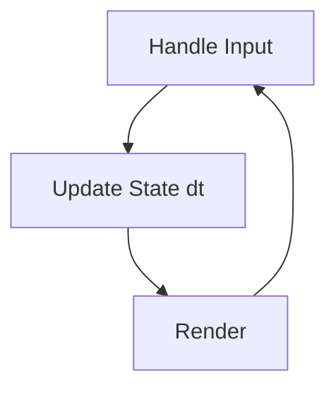

# Game Loop

## Learning Objectives

Setelah lesson ini user mampu:

- Menjelaskan 3 tahap loop: input → update → render
- Menulis loop dengan `requestAnimationFrame`
- Menjelaskan kenapa butuh delta time

## Concept

Game Loop adalah `while(true)` yang berjalan tiap frame. Analogi: detak jantung — tiap detak, game bernapas: dengar input, gerakkan dunia, gambar ulang.

## Why It Matters

Tanpa loop, game statis. Semua bug "gerakan beda di HP vs laptop" berakar dari loop yang salah.

## Visual Explanation



## Example

```ts
let last = performance.now();
function loop(now: number) {
  const dt = Math.min((now - last) / 1000, 0.05); // detik, clamp
  update(dt);
  render();
  last = now;
  requestAnimationFrame(loop);
}
requestAnimationFrame(loop);

function update(dt: number) { ball.x += ball.vx * dt; }
function render() { /* draw canvas */ }
```

## AI Coding with OpenCode

Minta AI membuat loop template yang frame-rate independent, bukan `setInterval` tetap.

## Example Prompt

```text
You are a senior game developer.
Context: File src/main.ts kosong, target Canvas 2D, TS.
Task: Buatkan game loop dengan requestAnimationFrame + dt clamp 0.05 + FPS counter.
Constraints: Tanpa engine, maksimal 60 baris.
Acceptance Criteria: npm run dev jalan, FPS tampil, gerakan konsisten di 30/60fps.
```

## Practical Exercise

Buat kotak bergerak 100 px/detik ke kanan, wrap saat keluar layar. Gunakan `dt`.

## Challenge

Tambahkan pause (Space) dan FPS meter. Pastikan dt tidak meledak setelah unpause.

## Common Mistakes

- Pakai `setInterval(16)` → drift + tidak sinkron monitor.
- Lupa clamp dt → teleport setelah tab inactive.
- Update + render dicampur → susah test.

## Debugging

Masalah: gerakan cepat di 144Hz. Penyebab: `x += speed` tanpa `* dt`. Fix: selalu `* dt`.

## Summary

Loop = input → update(dt) → render, diulang via rAF. Kunci: delta time + clamp.

## Next Lesson

→ `03-game-mechanics.md` — Mechanics vs Rules vs Core Loop.
