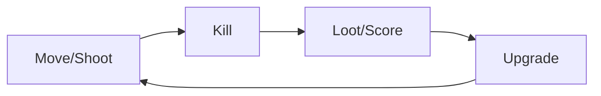

# Mechanics, Rules, Core Loop

## Learning Objectives

Setelah lesson ini user mampu:

- Membedakan mechanic, rule, core loop
- Menulis core loop 1 kalimat untuk game sendiri
- Menilai apakah mechanic fun dalam 30 detik

## Concept

- **Mechanic** = kata kerja (jump, dash, shoot).
- **Rule** = batasan (jump hanya jika grounded, ammo 6).
- **Core Loop** = lingkaran mechanic → reward → ulang (bunuh → loot → upgrade → bunuh lebih cepat).

## Why It Matters

Game membosankan = core loop lemah, bukan grafik jelek. Perbaiki loop dulu sebelum polish.

## Visual Explanation



## Example

Breakout: gerakkan paddle (mechanic) → pantulkan bola → hancurkan bata → skor → level lebih cepat. Rule: bola jatuh = nyawa -1, 3 nyawa = game over.

```text
Core loop 1 kalimat: "Pantul bola, hancurkan bata, kejar skor sebelum kehabisan nyawa."
```

## AI Coding with OpenCode

Minta AI mengkritik core loop-mu: apakah tiap 30 detik ada keputusan + reward?

## Example Prompt

```text
You are a senior game designer.
Context: Game saya Breakout clone, paddle + bola + 3 nyawa.
Task: Nilai core loop saya dan usulkan 2 variasi mechanic + 1 twist risk-vs-reward.
Acceptance Criteria: Tabel mechanic/rule/reward + alasan fun dalam 30 detik.
```

## Practical Exercise

Tulis core loop game favoritmu dalam 1 kalimat + pecah jadi 3 mechanic dan 2 rules.

## Challenge

Tambahkan 1 risk-vs-reward ke Pong (misal: zona cepat = 2 poin tapi paddle menyusut).

## Common Mistakes

- 10 mechanic di game pertama.
- Rule tidak tertulis → playtester bingung.
- Reward terlalu lama (5 menit baru fun).

## Debugging

Game terasa hambar? Cek: (1) ada keputusan tiap 10 detik? (2) ada reward visual/suara langsung? Jika tidak, tambah juice, bukan fitur.

## Summary

Mechanic = aksi, Rule = batas, Core Loop = alasan main lagi. Satu loop kuat > sepuluh fitur lemah.

## Next Lesson

→ `01-ai-coding/01-ai-coding.md` — AI sebagai pair programmer.
