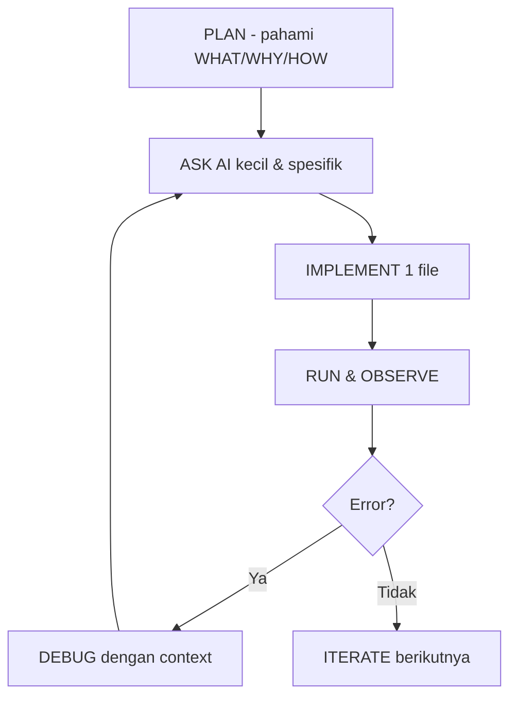

# AI Coding sebagai Pair Programmer

## Learning Objectives

Setelah lesson ini user mampu:

- Membedakan peran AI: assistant vs pair programmer vs agent
- Menerapkan pola PLAN → ASK → IMPLEMENT → RUN → DEBUG → ITERATE
- Menulis prompt context-aware yang testable

## Concept

AI bukan pengganti pemahaman. Peran bertingkat: (1) **Assistant** jawab pertanyaan, (2) **Pair programmer** tulis kode bersama file terbuka, (3) **Agent** (OpenCode) ubah banyak file + jalankan terminal. Makin tinggi otonomi, makin penting context + acceptance criteria.

## Why It Matters

Prompt vague → kode halusinasi → bug misterius. Prompt spesifik + konteks repo → AI jadi senior yang mempercepat 3-5x.

## Visual Explanation



## Example

Buruk: "Buatkan game RPG". Baik: incremental.

```text
Context: src/player.ts ada class Player {x,y,hp}.
Task: Tambahkan method takeDamage(amount) + invincible 0.5s.
Constraints: Jangan ubah file lain. Ikuti style existing.
Acceptance: npm run dev jalan, player kedip saat invincible.
```

## AI Coding with OpenCode

Di OpenCode: buka file relevan dulu (`player.ts`, `main.ts`), lalu prompt kecil. Minta AI jelaskan What/Why sebelum code.

## Example Prompt

```text
You are a senior game developer.
Context: @src/player.ts, @src/main.ts. Player bergerak tapi belum ada damage.
Task: Implement takeDamage + knockback sederhana.
Requirements: invincible 0.5s, hp clamp 0-100, emit event onDeath.
Constraints: Hanya ubah player.ts. Tanpa library baru.
Acceptance Criteria: tsc lolos, mati saat hp 0, tidak ada teleport.
```

## Practical Exercise

Ambil 1 fungsi di project-mu, minta AI refactor + jelaskan 3 baris paling berisiko.

## Challenge

Minta AI buat unit test kecil untuk `takeDamage` (hp 100 → damage 30 → 70, invincible block damage kedua).

## Common Mistakes

- Minta seluruh game sekaligus.
- Tidak memberi file context → AI menebak API.
- Tidak menjalankan kode → bug menumpuk.

## Debugging

AI ngaco? Perkecil task, tempel error log + file terkait, minta diagnosis dulu sebelum fix: "Jelaskan 3 kemungkinan penyebab, lalu pilih 1 paling mungkin."

## Summary

AI kuat jika kamu kuat di PLAN + context + iterasi kecil. Kamu pilot, AI kopilot.

## Next Lesson

→ `02-prompt-engineering.md` — Prompt Engineering + Context Management.
