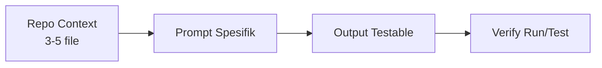

# Prompt Engineering & Context Management

## Learning Objectives

Setelah lesson ini user mampu:

- Menulis prompt Context-Task-Requirements-Constraints-Acceptance
- Mengelola repository context agar AI tidak halusinasi
- Melakukan debugging berbasis context

## Concept

Prompt bagus = spesifikasi mini. Formula: **Context** (file + tujuan) → **Task** (1 tugas) → **Requirements** (detail) → **Constraints** (jangan) → **Acceptance** (cara verifikasi). Context management = memilih file yang relevan, bukan seluruh repo.

## Why It Matters

80% kualitas output AI ditentukan context. Terlalu sedikit → menebak. Terlalu banyak → bingung + mahal.

## Visual Explanation



## Example

```text
Context:
- @src/main.ts (game loop + dt)
- @src/player.ts (movement)
Task: Tambahkan jump dengan gravity + coyote time 0.1s.
Requirements: jumpVel 480, gravity 1200, hanya saat grounded/coyote.
Constraints: Jangan ubah input mapping. Max 40 baris baru.
Acceptance: tsc lolos, tidak double-jump, terasa responsif.
```

## AI Coding with OpenCode

Gunakan `@file` untuk referensi, minta rencana dulu untuk tugas >1 file: "Buatkan plan (what/which files/expected) sebelum code."

## Example Prompt

```text
You are a senior game developer.
Context: @src/main.ts @src/player.ts @src/input.ts. Bug: player kadang double-jump.
Task: Diagnosis dulu, lalu fix.
Requirements: Jelaskan 3 hipotesis, pilih 1, tunjukkan diff minimal.
Constraints: Jangan refactor besar.
Acceptance Criteria: Reproduksi hilang, jump konsisten 20x tekan.
```

## Practical Exercise

Tulis ulang 1 prompt lamamu ke format 5-bagian di atas. Bandingkan outputnya.

## Challenge

Buat `AGENTS.md` mini: style code + cara run + larangan (misal: jangan tambah dep tanpa izin).

## Common Mistakes

- Prompt satu kalimat.
- Melempar 20 file sekaligus.
- Tidak menyertakan error log asli.

## Debugging

Template debug: Bug → Context (file+log) → Diagnosis (3 hipotesis) → Fix minimal → Test ulang. Minta AI ikuti urutan itu.

## Summary

Spesifik + konteks ramping + acceptance jelas = AI dapat diandalkan.

## Next Lesson

→ `03-prompt-patterns-gamedev.md` — Pola Prompt Khusus Game Development.
