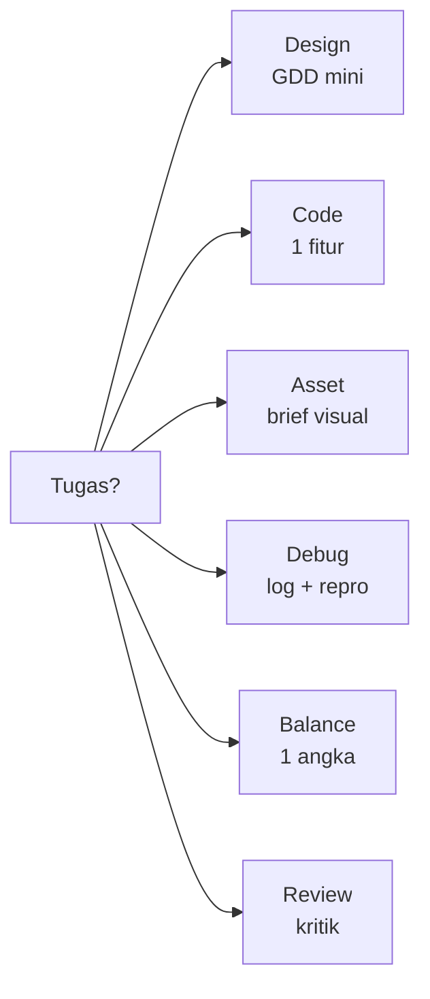

# Pola Prompt Khusus Game Development

## Learning Objectives

Setelah lesson ini user mampu:

- Memilih pola prompt yang tepat untuk 6 tugas game (desain, kode, aset, debug, balance, review)
- Menulis prompt yang testable dengan acceptance criteria
- Membedakan prompt vague vs spesifik lewat contoh nyata

## Concept

Satu format prompt tidak cocok untuk semua tugas. Minta desain butuh konteks selera + batasan scope. Minta kode butuh file + API. Minta debug butuh log + repro. Pola = cetakan yang tinggal diisi — fleksibel dipakai ulang tiap proyek.

## Why It Matters

Prompt generik "buatkan musuh" menghasilkan musuh generik yang tidak cocok dengan game-mu. Pola spesifik menghasilkan output yang langsung pakai.

## Visual Explanation



```svg-anim
nodes: [Tugas, Pola, Output testable]
flow: Tugas -> Pola -> Output testable
highlight: Pola
```

## Example

Enam pola siap pakai:

**1. Design** — minta GDD mini, bukan kode:

```text
Context: Saya buat top-down shooter web, 1 arena, pemula.
Task: Buatkan GDD 1 halaman: core loop 1 kalimat, 3 rules, win/lose, MVP vs Later.
Constraints: Tanpa multiplayer. Scope 1 minggu.
Acceptance: Ada tabel mechanic/rule/reward.
```

**2. Code** — 1 fitur, sebut file:

```text
Context: @src/player.ts (gerak WASD jalan, 260px/s).
Task: Tambahkan dash (Shift): burst 600px/s selama 0.15 dtk, cooldown 1 dtk.
Constraints: Hanya player.ts. Jangan ubah input mapping.
Acceptance: tsc lolos, tidak tembus wall saat dash.
```

**3. Asset** — brief visual konkret:

```text
Task: Prompt gambar untuk AI image generator.
Requirements: "2D pixel slime hijau, 4 idle frames, side view, plain dark background, 32x32 per frame, konsisten".
Acceptance: Sheet 4 koloms, ukuran sama, tanpa teks di gambar.
```

**4. Debug** — diagnosis dulu:

```text
Bug: bola kadang tembus paddle saat fps drop.
Repro: 1) main 2) biarkan fps <30 3) bola cepat → tembus.
Files: @src/ball.ts @src/physics.ts + log dt spike 0.08.
Task: 3 hipotesis terurut, pilih 1, fix minimal.
```

**5. Balance** — 1 angka + metrik:

```text
Context: Wave 2 terlalu sulit, 4/5 tester kalah <30 dtk.
Task: Usulkan 1 tweak angka (speed/hp/interval) + metrik sukses (misal: menang >60% dalam 90 dtk).
```

**6. Review** — minta dikritik:

```text
Task: Kritik core loop saya sebagai playtester kejam: di detik berapa bosan? Usulkan 2 tweak terkecil tanpa tambah scope.
```

## AI Coding with OpenCode

Simpan 6 pola ini di `prompts/` proyekmu. Saat butuh, salin pola + isi 3 baris konteks. Konsisten = AI makin akurat karena gaya permintaanmu stabil.

## Example Prompt

```text
You are a senior game developer.
Context: @src/enemy.ts AI masih if-else dalam, susah tuning.
Task: (Pola Code) Refactor ke state machine patrol/chase/attack + config ENEMY.
Constraints: Satu file. Perilaku luar sama.
Acceptance Criteria: tsc lolos, ada telegraph 0.3 dtk sebelum serang.
```

## Practical Exercise

Ambil 1 tugas nyata di proyekmu. Tulis prompt vague versi lama, lalu tulis ulang dengan pola yang cocok. Bandingkan output AI.

## Challenge

Buat file `prompts/balance.md` berisi pola Balance + metrik proyekmu (misal: "wave 1 menang >80% dalam 90 dtk"). Pakai tiap kali tuning.

## Common Mistakes

- Pola Code dipakai untuk tugas Design (langsung minta kode tanpa GDD).
- Acceptance kabur ("bagus", "enak") — tidak bisa diverifikasi.
- Menumpuk 3 pola dalam 1 prompt (desain + kode + review sekaligus).

## Debugging

Output AI tidak cocok? Cek urutan: (1) pola salah untuk tugasnya, (2) context kurang (file/log tidak ditempel), (3) constraints tidak ada (AI bebas menebak). Perbaiki satu, ulangi.

## Summary

Pilih pola sesuai tugas → isi konteks → kunci constraints → tulis acceptance yang bisa di-run. Enam pola ini cukup untuk 90% kebutuhan game dev.

## Next Lesson

→ `04-iteration-game.md` — Iteration: dari kasar ke enak.
