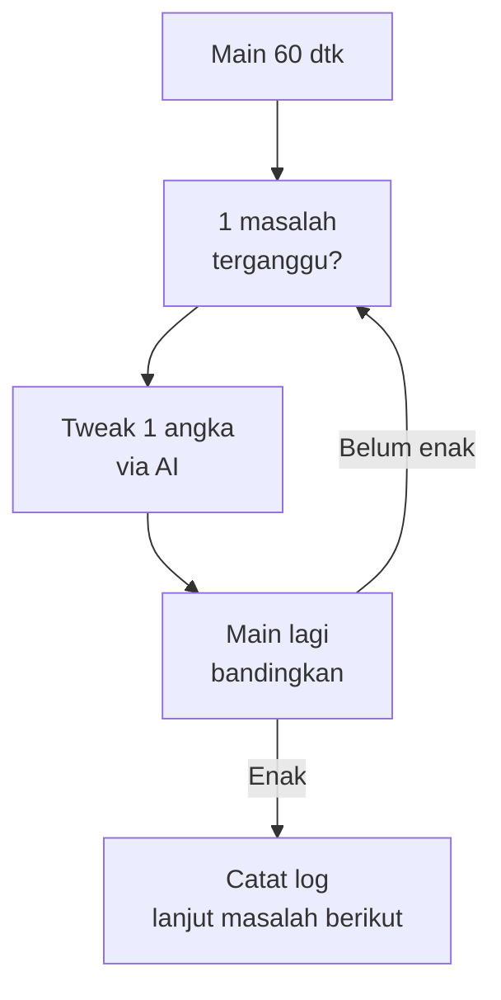

# Iteration Game: dari Kasar ke Enak

## Learning Objectives

Setelah lesson ini user mampu:

- Menjalankan loop iteration: observasi → 1 tweak → verifikasi
- Membaca 3 contoh iteration nyata (gerak, lompat, musuh)
- Mencatat log iteration agar keputusan tidak hilang

## Concept

Game enak lahir dari iterasi, bukan inspirasi. Loop-nya: **mainkan 60 detik → catat 1 masalah paling mengganggu → ubah 1 angka → mainkan lagi → bandingkan**. AI mempercepat tiap putaran: merumuskan observasi, mengusulkan tweak, mencatat log.

## Why It Matters

Pemula mengubah 5 angka sekaligus lalu tidak tahu mana yang berhasil. Profesional mengubah 1, mengukur, mencatat — 10 putaran kecil mengalahkan 1 rewrite besar.

## Visual Explanation



```svg-anim
nodes: [Main, Observasi, Tweak, Verifikasi]
flow: Main -> Observasi -> Tweak -> Verifikasi -> Main
highlight: Tweak
```

## Example

Tiga contoh iteration nyata dengan angka:

**1. Paddle Breakout terasa lambat**

```text
Observasi: "Bola cepat tidak terkejar, paddle seperti berat."
Prompt: "Context: @src/paddle.ts speed 200. Tester 3/3 gagal kejar bola >400px/s. Usulkan 1 tweak + metrik."
Tweak: speed 200 → 320 + deadzone keyboard 0.
Verifikasi: 20 reli tanpa keluhan, tidak overshoot. Catat.
```

**2. Lompat platformer kaku**

```text
Putaran 1: gravity 1200 terasa melayang → naikkan ke 2200, jumpVel 720.
Putaran 2: masih jatuh dari tepi bikin kesal → tambah coyote 0.1.
Putaran 3: tekan lompat sebelum mendarat tidak dihitung → tambah buffer 0.12.
Hasil: 3 putaran, 3 angka, kontrol "mahal".
```

**3. Slime terlalu sulit**

```text
Observasi: "Disergap tanpa peringatan, mati 2x dalam 30 dtk."
Tweak berurutan (satu per putaran):
  a) speed 200 → 120 (bisa dihindari)
  b) tambah telegraph 0.3 dtk berkedip sebelum serang (adil)
  c) hysteresis: kejar <180, berhenti >260 (tidak flicker)
Metrik sukses: tester selamat >60 dtk tanpa mati.
```

Template log iteration:

```text
| # | Masalah | Tweak | Hasil | Keputusan |
|---|---------|-------|-------|-----------|
| 1 | paddle lambat | speed 200→320 | 20 reli OK | keep |
| 2 | lompat melayang | gravity→2200 | arc pas | keep |
```

## AI Coding with OpenCode

Minta AI jadi notulen iteration: kamu beri observasi mentah, AI rumuskan tweak + metrik + catat log.

## Example Prompt

```text
You are my iteration partner.
Context: @src/player.ts @BALANCE. Observasi mentah: "lompat kadang tidak keluar saat lari cepat di tepi".
Task: Rumuskan 1 hipotesis + 1 tweak terkecil + cara verifikasi 20x.
Constraints: Jangan tweak 2 angka sekaligus.
Acceptance Criteria: Saya tahu persis apa yang diubah dan cara mengukurnya.
```

## Practical Exercise

Mainkan proyekmu 60 detik. Tulis 1 masalah paling mengganggu dalam 1 kalimat. Minta AI rumuskan tweak + verifikasi. Lakukan, catat di log.

## Challenge

Lakukan 3 putaran iteration berturut-turut (maks 30 menit total). Setiap putaran: 1 masalah, 1 tweak, 1 baris log. Rasakan bedanya di putaran 3.

## Common Mistakes

- Tweak 3 angka sekaligus → tidak tahu mana yang manjur.
- Tidak ada metrik ("terasa enak" tanpa angka/percobaan).
- Iteration tanpa log → minggu depan mengulang kesalahan sama.
- Minta AI tweak tanpa observasi ("buat lebih enak" tanpa data).

## Debugging

Sudah 5 putaran tidak membaik? Masalahnya bukan angka — kemungkinan: (1) tujuan tidak jelas (tambah tutorial/panah), (2) bug tersembunyi (cek dt/collision dulu), (3) scope salah (fitur kurang, bukan angka). Hentikan tuning, diagnosis ulang.

## Summary

Satu masalah + satu tweak + satu metrik + satu baris log, diulang. AI sebagai partner notulen membuat 10 putaran terasa ringan.

## Next Lesson

→ `02-opencode/01-opencode-setup.md` — OpenCode Setup.
