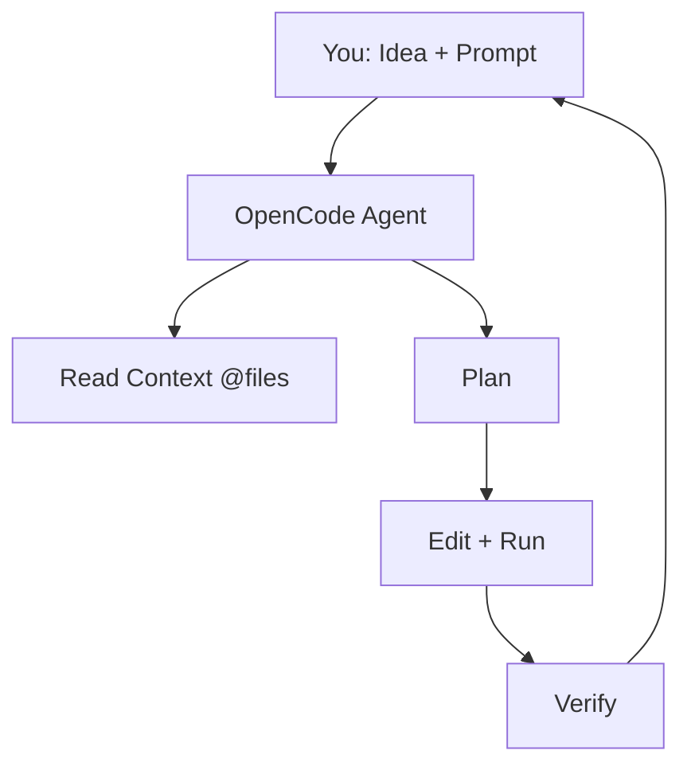

# OpenCode Setup & Struktur Project

## Learning Objectives

Setelah lesson ini user mampu:

- Install & verifikasi OpenCode
- Menjelaskan agent, context, instruction
- Membuat struktur project game yang rapi

## Concept

OpenCode = coding agent di terminal yang membaca repo, merencanakan, mengedit file, menjalankan perintah. Tiga pilar: **Agent** (pelaku), **Context** (file yang dilihat), **Instruction** (aturan di `AGENTS.md` / prompt).

## Why It Matters

Tanpa struktur, AI mengacak-acak file. Struktur baku bikin AI predictible.

## Visual Explanation



## Example

Struktur minimal game web:

```text
game/
├── index.html
├── src/main.ts      # loop + scene
├── src/player.ts    # movement + state
├── src/enemy.ts
├── src/input.ts
└── AGENTS.md        # aturan AI
```

`AGENTS.md` contoh:

```md
# Rules
- Gunakan TypeScript strict, tanpa any.
- Jangan tambah dependency tanpa izin.
- Setiap ubah >1 file: jelaskan What/Why/Files/Expected dulu.
- Verifikasi dengan npm run dev / tsc.
```

## AI Coding with OpenCode

Alur terminal: `opencode` → `/init` → tulis task kecil → review diff → `npm run dev`.

## Example Prompt

```text
You are a senior game developer.
Context: Repo kosong, target game Breakout web + TS + Canvas.
Task: Scaffolding struktur folder + AGENTS.md + main.ts hello-canvas.
Constraints: Tanpa engine. Minimal file.
Acceptance Criteria: npm run dev tampil canvas biru + kotak putih.
```

## Practical Exercise

Install OpenCode, jalankan `/init` di folder kosong, minta scaffolding di atas.

## Challenge

Tambahkan `npm run check` (tsc) dan minta AI mematuhinya tiap edit.

## Common Mistakes

- Memberi akses tanpa batas file sensitif.
- Tidak review diff AI.
- Instruksi bertentangan (minta cepat + minta sempurna + minta besar).

## Debugging

AI salah file? Perjelas context: "Hanya baca src/player.ts dan src/input.ts, abaikan yang lain." Kecilkan izin, bukan marah ke AI.

## Summary

OpenCode = agent + context + instruction. Struktur rapi + AGENTS.md = AI tertib.

## Next Lesson

→ `02-opencode-workflow.md` — Workflow Idea → Build.
