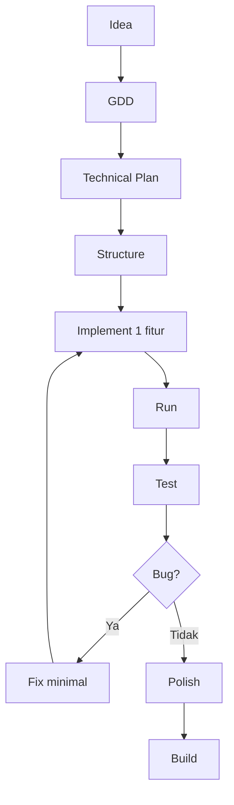

# OpenCode Workflow Idea → Build

## Learning Objectives

Setelah lesson ini user mampu:

- Menjalankan workflow 10 tahap dengan AI
- Merencanakan sebelum coding (technical plan)
- Melakukan iterasi debug yang disiplin

## Concept

Urutan baku: Idea → GDD → Technical Plan → Structure → Implement (kecil) → Run → Test → Debug → Refactor → Polish → Build. AI membantu tiap tahap, tapi kamu gatekeeper tiap gerbang.

## Why It Matters

Lompat langsung ke Implement = refactor 3x. 10 menit planning menghemat 3 jam coding.

## Visual Explanation



## Example

Technical plan Breakout (contoh output AI yang bagus):

```text
What: Paddle + bola + 8 bata, skor, 3 nyawa.
Files: main.ts (loop), paddle.ts, ball.ts, bricks.ts, ui.ts
Order: 1) loop+canvas 2) paddle 3) ball physics 4) collision 5) UI
Verify: tsc + main manual 60 detik tanpa error.
```

## AI Coding with OpenCode

Aturan: 1 prompt = 1 tahap. Jangan gabung "buatkan GDD + kode + asset".

## Example Prompt

```text
You are a senior game developer.
Context: @AGENTS.md. GDD Breakout sudah ada.
Task: Buatkan Technical Plan saja (belum code).
Requirements: Daftar file + urutan implementasi + cara test tiap tahap.
Constraints: Max 6 file, tanpa engine.
Acceptance Criteria: Saya bisa eksekusi tahap 1 tanpa bertanya lagi.
```

Lalu tahap implement:

```text
Task: Implement tahap 1 saja: canvas + loop + dt (src/main.ts).
Acceptance: npm run dev tampil FPS.
```

## Practical Exercise

Minta AI buatkan technical plan untuk game-mu, lalu eksekusi tahap 1 saja.

## Challenge

Simulasikan bug: matikan dt (`x += speed`), catat perilaku, lalu minta AI diagnosis dengan log.

## Common Mistakes

- "Lanjutkan semuanya" → AI ngawur di file 5+.
- Tidak run tiap tahap.
- Tidak commit git tiap milestone.

## Debugging

Workflow debug: reproduksi → log → hipotesis (3) → fix minimal → test 20x. Minta AI ikuti format itu.

## Summary

Rencana dulu, kode kecil, run sering, commit sering. AI cepat, kamu teliti.

## Next Lesson

→ `03-programming/01-variables.md` — Variables & State.
