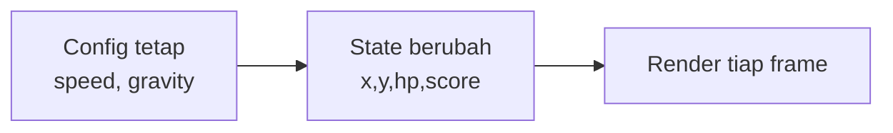

# Variables, Types & State

## Learning Objectives

Setelah lesson ini user mampu:

- Memakai `let/const`, tipe dasar TS, object/class untuk state game
- Membedakan state yang di-update tiap frame vs config tetap
- Menghindari `any` dan magic numbers

## Concept

Variable = kotak bernama. Di game, 90% bug dari state yang berubah sembarangan (hp jadi string, posisi NaN). TypeScript + state terpusat = obatnya.

## Why It Matters

`hp = "100"` + `hp - 30` = bug misterius. Tipe + inisialisasi benar mencegahnya sejak tulis.

## Visual Explanation



## Example

```ts
type Player = { x: number; y: number; vx: number; vy: number; hp: number; grounded: boolean };
const GRAVITY = 1200; // config: UPPER_CASE
const SPEED = 220;

const player: Player = { x: 50, y: 300, vx: 0, vy: 0, hp: 100, grounded: false };

function takeDamage(p: Player, dmg: number) {
  p.hp = Math.max(0, p.hp - dmg);
}
```

## AI Coding with OpenCode

Minta AI mengetikkan state-mu dan mengganti magic numbers jadi konstanta bernama.

## Example Prompt

```text
You are a senior TS game developer.
Context: @src/player.ts (banyak angka tersebar, ada any).
Task: Refactor: definisikan type Player/Enemy, ganti magic numbers jadi konstanta, hilangkan any.
Constraints: Jangan ubah logika gerak. Hanya player.ts.
Acceptance Criteria: tsc lolos, tidak ada any, semua angka punya nama.
```

## Practical Exercise

Refactor 1 file: kumpulkan semua angka (speed, jump, gravity) ke `CONFIG` objek.

## Challenge

Buat `GameState` (`menu|playing|paused|gameover`) + fungsi transisi, cegah update saat paused.

## Common Mistakes

- `let` untuk semua (harusnya `const`).
- `any` agar cepat → bug lambat.
- State tersebar di 10 file tanpa sumber tunggal.

## Debugging

`NaN` posisi? Cek inisialisasi (`undefined + number`), pembagian nol, atau `parseInt` tanpa fallback. Tambahkan `console.assert(Number.isFinite(p.x))`.

## Summary

Tipe + state rapi = game stabil. Config tetap, state berubah, render baca state.

## Next Lesson

→ `02-functions.md` — Functions, Arrays, Objects untuk game.
