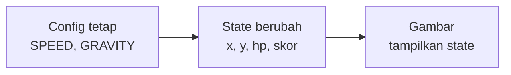

# Variables, Types & State

## Learning Objectives

Setelah lesson ini user mampu:

- Menyimpan data game di variable (`let`/`const`) dan menjelaskannya
- Memakai tipe TypeScript agar salah ketik ketahuan sejak ditulis
- Membedakan **config** (tetap) vs **state** (berubah tiap frame)

## Concept

**Variable** = kotak berlabel tempat menyimpan 1 nilai. Contoh: kotak berlabel `nyawa` berisi `3`, kotak `skor` berisi `0`.

Dua jenis kotak di game:

- `const` — kotak yang isinya **dikunci sekali**. Untuk angka aturan main yang tidak berubah: kecepatan lari, gravitasi, lebar layar. Ditulis KAPITAL agar terlihat: `const SPEED = 220`.
- `let` — kotak yang isinya **boleh diganti**. Untuk kondisi yang berubah tiap detik: posisi, nyawa, skor.

**Type** = label jenis isi kotak: `number` (angka), `string` (teks), `boolean` (ya/tidak). TypeScript memeriksa label ini saat kamu menulis — salah isi langsung digarisbawahi merah, sebelum game dijalankan. Ini seperti asisten yang menepuk bahu: "kamu mau isi teks ke kotak angka, yakin?"

**State** = kumpulan semua kotak `let` saat ini. "State pemain" = posisi + nyawa + sedang apa. Game pada dasarnya: baca input → ubah state → gambar state.



## Why It Matters

Sebagian besar bug pemula berasal dari kotak yang salah isi: nyawa jadi teks `"100"` sehingga `100 - 30` error, atau posisi jadi `NaN` (bukan angka) sehingga karakter hilang. Tipe + pemisahan config/state mencegah seluruh kelas bug ini sejak awal.

## Visual Explanation

Bayangkan papan skor pertandingan: angka **aturan** (lapangan 100m, 2 babak) ditulis permanen di dinding = config. Angka **berjalan** (skor 2-1, menit 63) ditulis dengan kapur dan terus dihapus-ditulis = state. Render = fotografer yang memotret papan tiap detik.

## Example

**Tingkat A — Tiga kotak pertama (5 menit)**

```ts
let nyawa = 3;      // let: boleh berkurang
let skor = 0;       // let: boleh bertambah
const NAMA = 'Aku'; // const: nama tidak berubah

skor = skor + 100;  // ambil isi lama, tambah, simpan lagi
nyawa = nyawa - 1;  // kena musuh!
console.log(NAMA + ' skornya ' + skor + ', nyawa ' + nyawa);
```

> Tanda berhasil: console menampilkan "Aku skornya 100, nyawa 2".

**Tingkat B — Tipe + config (inti lesson, 15 menit)**

```ts
// Satu tipe untuk seluruh data pemain — rapi dalam 1 tempat
type Pemain = {
  x: number;       // posisi horizontal
  y: number;       // posisi vertikal
  hp: number;      // nyawa 0-100
  diTanah: boolean; // true = sedang menapak
};

const GRAVITY = 1200; // config: ditulis sekali, dipakai di mana-mana
const SPEED = 220;

const pemain: Pemain = { x: 50, y: 300, hp: 100, diTanah: false };

function kenaSerang(p: Pemain, damage: number) {
  p.hp = Math.max(0, p.hp - damage); // Math.max agar tidak minus
}
```

Coba langgar tipe dengan sengaja: tulis `pemain.hp = "penuh"`. Editor langsung merah — itulah tipe yang bekerja. Kembalikan lagi.

> Tanda berhasil: tidak ada garis merah, `kenaSerang(pemain, 30)` membuat hp 70.

**Tingkat C — State permainan (pendalaman, opsional)**

```ts
let statusGame: 'menu' | 'main' | 'jeda' | 'selesai' = 'menu';
// Tanda | artinya "salah satu dari ini" — status tidak bisa typo jadi 'maen'

function update(dt: number) {
  if (statusGame !== 'main') return; // bukan saat main? jangan update apa-apa
  // ... gerakan, musuh, tabrakan
}
```

Satu baris penjaga ini menghentikan seluruh dunia saat jeda/menu — pola yang dipakai di semua game.

## AI Coding with OpenCode

Minta AI merapikan angka-angka yang tersebar jadi config bernama + memberi tipe, tanpa mengubah cara game berjalan.

## Example Prompt

```text
You are a senior TS game developer.
Context: @src/player.ts — angka kecepatan/lompat tersebar, ada 2 'any'.
Task: Buatkan type Pemain/Musuh, kumpulkan angka jadi konstanta CONFIG, hilangkan 'any'.
Constraints: Jangan ubah cara gerak. Hanya file ini.
Acceptance Criteria: tsc lolos, tidak ada 'any', tiap angka punya nama jelas.
```

## Practical Exercise

1. **Pemanasan (5 menit):** tulis Tingkat A, ubah-ubah nilainya, lihat console.
2. **Inti (15 menit):** di proyekmu, kumpulkan semua angka ajaib (speed, lompat, gravitasi) ke satu objek `CONFIG` di atas file. Jalankan game — harus terasa persis sama.
3. **Cek pemahaman:** jelaskan ke teman (atau ke Tanya AI): apa beda `let` vs `const`? Kapan pakai masing-masing? Beri 1 contoh game untuk tiap kata: `number`, `string`, `boolean`.

## Challenge

Tambahkan `statusGame` seperti Tingkat C + tombol P untuk jeda. Pastikan musuh ikut berhenti (bukan cuma pemain). Kalau musuh tetap jalan, artinya update musuh tidak dijaga status — perbaiki.

## Common Mistakes

| Gejala | Penyebab | Perbaikan |
|--------|----------|-----------|
| Karakter hilang / tidak tergambar | Posisi jadi `NaN` (misal `undefined + 5`) | Pastikan semua angka punya nilai awal; tambah `console.log(x)` |
| `hp` berkurang aneh ("10030") | `hp` berisi teks, `+` menempel string | Beri tipe `number`, jangan bungkus angka dengan kutip |
| Ubah 1 angka, lupa di 3 tempat lain | Angka tersebar (magic numbers) | Kumpulkan di `CONFIG`, pakai nama itu di mana-mana |
| Semua pakai `let` | Kebiasaan — padahal aturannya tetap | Aturan main = `const` KAPITAL |
| `any` di mana-mana agar "cepat" | Menonaktifkan pemeriksa tipe | Ganti `any` dengan tipe sebenarnya |

## Debugging

- **Nilai `NaN`?** Telusuri mundur: angka itu dihitung dari apa? Salah satu bahannya `undefined` (lupa inisialisasi), hasil bagi nol, atau `parseInt` teks kosong. Tambahkan `console.assert(Number.isFinite(pemain.x))` — berhenti tepat di frame yang rusak.
- **"Tipe error yang tidak kumengerti"?** Tempel pesan error + 10 baris kode ke Tanya AI. Jangan ditebak.

## Summary

`const` untuk aturan tetap, `let` untuk kondisi berubah, tipe untuk menangkap salah isi sejak ditulis. Config tetap + state berubah + gambar membaca state — tiga peran ini menjaga game tetap stabil saat membesar.

## Next Lesson

→ `02-functions.md` — Functions, Arrays & Objects.
