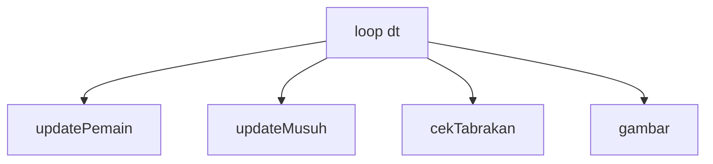

# Functions, Arrays & Objects

## Learning Objectives

Setelah lesson ini user mampu:

- Memecah update game jadi fungsi-fungsi kecil yang bernama jelas
- Menyimpan banyak entity (musuh, peluru) di array dan mengelolanya
- Memakai object sebagai kamus config (data-driven)

## Concept

Tiga alat, tiga analogi dapur:

- **Function (fungsi)** = resep masakan. Punya nama ("goreng telur"), bahan masuk (parameter), hasil keluar (return). Daripada menulis langkah menggoreng 10 kali, tulis resep sekali, panggil 10 kali. Di game: `updatePemain(dt)`, `cekTabrakan()`.
- **Array** = nampan berisi banyak item sejenis. `peluru = [p1, p2, p3]`. Mau update semua? Angkat nampannya (loop), kerjakan satu per satu.
- **Object** = kartu resep berisi pasangan nama-nilai: `{ nama: 'Slime', hp: 20, speed: 60 }`. Dipakai untuk config: tambah musuh baru = tambah 1 kartu, bukan tulis kode baru.

Aturan emas: **1 fungsi = 1 pekerjaan**. Fungsi `update()` raksasa 120 baris yang mengurus pemain + musuh + tabrakan + skor tidak bisa dites dan menakutkan untuk diubah. Pecah jadi 4 fungsi 20 baris — tiap fungsi bisa dipahami dalam 1 menit.



## Why It Matters

Kode game tumbuh cepat: 50 baris minggu ini, 500 baris bulan depan. Tanpa fungsi kecil + array + config, setiap tambah fitur merusak 2 fitur lama. Dengan ketiganya, tambah 1 tipe musuh = tambah 3 baris data.

## Visual Explanation

Bayangkan dapur restoran saat jam sibuk: koki tidak menghafal 100 langkah di kepala (fungsi raksasa). Ia punya kartu resep (fungsi kecil), nampan bahan (array), dan buku menu (object config). Pesanan 50 piring = jalankan resep yang sama 50x.

## Example

**Tingkat A — Satu resep pertama (5 menit)**

```ts
function sapa(nama: string): string {
  return 'Halo, ' + nama + '!'; // return = hasil yang dikembalikan
}
console.log(sapa('Slime')); // memanggil resep dengan bahan 'Slime'
```

Parameter = bahan masuk, `return` = hidangan keluar. Fungsi tanpa `return` tetap berguna (misal langsung mengubah state).

> Tanda berhasil: console menampilkan "Halo, Slime!".

**Tingkat B — Nampan peluru (inti lesson, 15 menit)**

```ts
type Peluru = { x: number; y: number; cepat: number; mati: boolean };
let peluru: Peluru[] = []; // nampan kosong

function tembak(x: number, y: number) {
  peluru.push({ x, y, cepat: 400, mati: false }); // taruh 1 di nampan
}

function updatePeluru(dt: number) {
  for (const p of peluru) p.x = p.x + p.cepat * dt; // geser semua
  // buang yang mati / keluar layar — buat nampan BARU berisi yang hidup
  peluru = peluru.filter((p) => !p.mati && p.x < 900);
}
```

Kenapa `filter` (buat nampan baru), bukan mencabut dari nampan saat dipegang? Karena mencabut item saat loop membuat item berikutnya **terlewat** — bug klasik "peluru kadang tidak hilang". Aturan: jangan ubah panjang array di tengah loop.

> Tanda berhasil: tembak 10x, semua peluru terbang dan hilang di tepi kanan, jumlah array kembali 0.

**Tingkat C — Kartu config musuh (pendalaman, opsional)**

```ts
const MUSUH: Record<string, { nama: string; hp: number; speed: number }> = {
  slime: { nama: 'Slime', hp: 20, speed: 60 },
  kelelawar: { nama: 'Kelelawar', hp: 10, speed: 140 },
};
function spawn(jenis: 'slime' | 'kelelawar', x: number) {
  const kartu = MUSUH[jenis]; // ambil kartu resepnya
  // ... buat musuh dengan hp & speed dari kartu
}
```

Musuh baru? Tambah 1 kartu. Tidak perlu sentuh logika spawn. Ini yang disebut **data-driven**: perilaku mengikuti data, bukan kode.

## AI Coding with OpenCode

Minta AI memecah fungsi raksasa jadi fungsi kecil — tugas yang sangat cocok untuk AI karena mekanis dan mudah diverifikasi ("game terasa sama").

## Example Prompt

```text
You are a senior game developer.
Context: @src/main.ts — fungsi update() 120 baris campur pemain/musuh/tabrakan.
Task: Pecah jadi updatePemain/updateMusuh/cekTabrakan. Jangan ubah perilaku game.
Constraints: Maks 25 baris per fungsi. Jangan ubah fungsi gambar.
Acceptance Criteria: tsc lolos, game dimainkan 60 detik terasa persis sama.
```

## Practical Exercise

1. **Pemanasan (5 menit):** tulis Tingkat A, panggil dengan 3 nama berbeda.
2. **Inti (15 menit):** di proyekmu, buat `tembak()` + `updatePeluru()` seperti Tingkat B. Tembak 10x, pastikan tidak ada yang nyangkut.
3. **Cek pemahaman:** tunjuk 1 fungsi di kodemu, jawab: apa 1 pekerjaannya? Kalau jawabannya ada kata "dan" 2x ("gerak pemain DAN cek tabrakan DAN update skor"), itu tanda harus dipecah.

## Challenge

Buat `MUSUH` seperti Tingkat C dengan 2 tipe + fungsi `spawn(jenis)`. Lalu minta AI menulis test kecil: spawn slime → hp-nya 20, spawn kelelawar → speed-nya 140.

## Common Mistakes

| Gejala | Penyebab | Perbaikan |
|--------|----------|-----------|
| Item kadang terlewat / tidak hilang | `splice` di dalam `for` | Pakai `filter` (nampan baru) atau loop mundur |
| Fungsi 100+ baris, takut diubah | Semua logika di 1 tempat | Pecah per tanggung jawab, maks ~25 baris |
| Update + gambar campur 1 fungsi | Tidak bisa test logika tanpa layar | Pisah: fungsi update (angka) vs fungsi gambar |
| Kode spawn disalin 5x beda angka | Belum pakai config | Kumpulkan di 1 object `MUSUH`/`ITEMS` |
| Parameter 6 biji, lupa urutan | Fungsi mengerjakan terlalu banyak | Bungkus jadi 1 object parameter |

## Debugging

- **Peluru/enemy bertingkah acak?** Tambahkan `console.log(peluru.length)` tiap detik. Jumlah yang tumbuh tanpa henti = ada yang tidak pernah dibuang (cek `filter`).
- **Fungsi tidak dipanggil?** Sisipkan `console.log('masuk updateMusuh')` sekali. Sering ternyata namanya typo saat dipanggil.

## Summary

Fungsi kecil bernama jelas + array dikelola dengan `filter` + config sebagai object = kode yang berani diubah dan mudah dites. Tambah konten = tambah data, bukan tambah kusut.

## Next Lesson

→ `03-conditions-loops.md` — Conditions & Loops.
