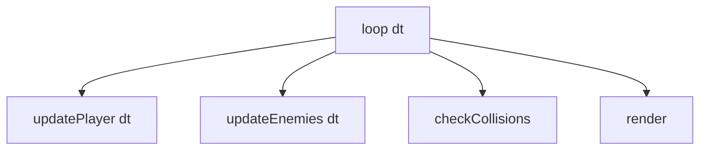

# Functions, Arrays & Objects

## Learning Objectives

Setelah lesson ini user mampu:

- Memecah update game jadi fungsi kecil (`updatePlayer`, `updateEnemies`, `checkCollisions`)
- Mengelola list entity dengan array (`enemies`, `bullets`)
- Memakai object/config untuk data-driven design

## Concept

Fungsi = kata kerja yang bisa dites. Array = kerumunan entity. Object = kamus data (config musuh, level). Game loop ideal hanya 5 baris: panggil fungsi-fungsi kecil.

## Why It Matters

Fungsi 200 baris = tidak bisa dites, tidak bisa dipercaya AI untuk refactor. Fungsi 15 baris = mudah dites + mudah diminta ke AI.

## Visual Explanation



## Example

```ts
type Bullet = { x: number; y: number; vx: number; dead: boolean };
let bullets: Bullet[] = [];

function spawnBullet(x: number, y: number) {
  bullets.push({ x, y, vx: 400, dead: false });
}
function updateBullets(dt: number) {
  for (const b of bullets) b.x += b.vx * dt;
  bullets = bullets.filter(b => !b.dead && b.x < 900);
}
```

## AI Coding with OpenCode

Minta AI memecah fungsi raksasa jadi kecil + buat test logika murni (tanpa canvas).

## Example Prompt

```text
You are a senior game developer.
Context: @src/main.ts fungsi update() 120 baris campur player/enemy/collision.
Task: Pecah jadi updatePlayer/updateEnemies/checkCollisions tanpa ubah perilaku.
Constraints: Max 25 baris per fungsi. Tanpa ubah signature render.
Acceptance Criteria: tsc lolos, game tetap jalan sama, tiap fungsi punya 1 tanggung jawab.
```

## Practical Exercise

Pecah `update()`-mu jadi 3 fungsi. Tambahkan `spawnEnemy()` + filter `dead`.

## Challenge

Buat `ENEMIES` config: `{ slime: {hp:20,speed:60}, bat:{hp:10,speed:140} }` + `spawn(type)` data-driven.

## Common Mistakes

- Mutasi array saat loop (splice di for) → skip entity. Pakai filter atau loop mundur.
- Fungsi campur update+render.
- Duplikasi kode spawn di 5 tempat.

## Debugging

Peluru hilang acak? Kemungkinan filter terlalu agresif atau `dead` tidak pernah reset (object pooling). Log `bullets.length` tiap detik.

## Summary

Kecil + murni + data-driven = kode game yang tahan tumbuh.

## Next Lesson

→ `04-game-programming/01-game-loop-deltatime.md` — Delta Time mendalam.
