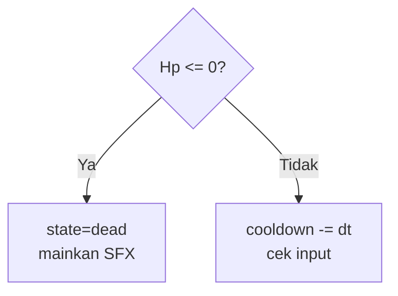

# Conditions & Loops untuk Logika Game

## Learning Objectives

Setelah lesson ini user mampu:

- Memakai `if/else`, `switch`, boolean logic untuk rule game
- Memakai `for`, `while`, `forEach`, `filter` untuk update entity
- Menulis win/lose dan cooldown tanpa bug

## Concept

Condition = keputusan (`if hp<=0 → mati`). Loop = kerjakan ke semua entity (`for enemy → update`). 80% bug logika dari dua hal: kondisi batas (`<` vs `<=`) dan loop yang mutasi array saat iterasi.

## Why It Matters

Game over tidak muncul, musuh tidak mati, cooldown tidak jalan — semua akar di condition/loop yang salah satu baris.

## Visual Explanation



## Example

```ts
// win/lose + cooldown yang benar
type Game = { state: 'playing'|'won'|'lost'; atkCd: number };
function updateGame(g: Game, dt: number, enemiesLeft: number, hp: number) {
  g.atkCd = Math.max(0, g.atkCd - dt); // selalu pakai dt
  if (hp <= 0) { g.state = 'lost'; return; }
  if (enemiesLeft === 0) { g.state = 'won'; return; }
}

// loop aman: jangan splice di for...of, pakai filter
bullets = bullets.filter(b => !b.dead);
enemies.forEach(e => updateEnemy(e, dt));
```

Switch untuk state machine ringan:

```ts
switch (player.state) {
  case 'idle': break;
  case 'attack': if (player.animDone) player.state = 'idle'; break;
  case 'dead': return; // hentikan update lain
}
```

## AI Coding with OpenCode

Minta AI audit kondisi batas dan loop berbahaya di file-mu.

## Example Prompt

```text
You are a senior game developer.
Context: @src/main.ts @src/enemy.ts. Bug: kadang musuh tidak mati, kadang game over telat.
Task: Audit semua if/loops terkait hp, dead, win/lose, cooldown.
Requirements: Daftar 3 kondisi paling berisiko + fix minimal + jelaskan < vs <=.
Constraints: Jangan refactor besar. Hanya tunjukkan diff.
Acceptance Criteria: tsc lolos, musuh hp 0 selalu mati di frame yang sama.
```

## Practical Exercise

Tambahkan: attack hanya jika `atkCd===0`, set `atkCd=0.4` setelah serang. Test spam klik.

## Challenge

Buat wave system: `waveEnemies = 3 + wave*2`, next wave saat `enemiesLeft===0 && state==='playing'`. Tampilkan "Wave 2!" 2 detik.

## Common Mistakes

- `if (hp = 0)` (assignment) bukan `===`.
- `timer -= 1` bukan `-= dt` → beda kecepatan di tiap fps.
- `splice` di dalam `for` → entity ke-skip. Pakai loop mundur atau `filter`.

## Debugging

Musuh hp 0 tapi hidup? Cek: (1) perbandingan pakai `<=` bukan `===` (damage bisa overshoot ke -5), (2) flag `dead` di-set tapi tidak di-filter, (3) update masih jalan setelah `state='lost'`.

## Summary

Kondisi tegas (`<=`, early return) + loop aman (`filter`/`forEach`) = logika game dapat diprediksi.

## Next Lesson

→ `04-oop-state-event.md` — OOP, State & Event.
