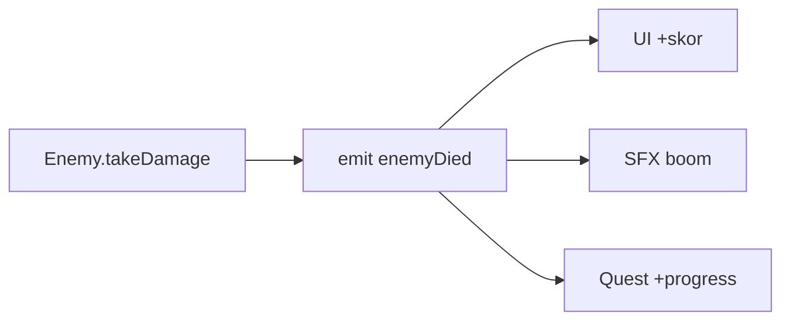

# OOP, State & Event untuk Game

## Learning Objectives

Setelah lesson ini user mampu:

- Memakai `class` untuk Player/Enemy dengan method jelas
- Memisahkan Game State global dari state entity
- Memakai event sederhana agar modul tidak saling mengunci

## Concept

Class = cetakan entity (data + perilaku). Game State = mode global (`menu|playing|paused|gameover`) yang menghentikan update saat bukan playing. Event = pesan ("enemyDied") agar UI/SFX bereaksi tanpa dipanggil langsung — fleksibel ditambah/dikurangi.

## Why It Matters

Tanpa pemisahan ini, `main.ts` jadi 500 baris: UI memanggil musuh, musuh memanggil audio, semua kusut dan takut diubah.

## Visual Explanation



## Example

```ts
type Handler = (data?: unknown) => void;
class Bus {
  private m = new Map<string, Handler[]>();
  on(ev: string, h: Handler) { this.m.set(ev, [...(this.m.get(ev) ?? []), h]); }
  emit(ev: string, d?: unknown) { this.m.get(ev)?.forEach(h => h(d)); }
}
export const bus = new Bus();

class Enemy {
  hp = 30; dead = false;
  constructor(public x: number, public y: number) {}
  takeDamage(n: number) {
    if (this.dead) return;
    this.hp -= n;
    if (this.hp <= 0) { this.dead = true; bus.emit('enemyDied', this); }
  }
}

// UI cukup dengar, tidak perlu tahu siapa membunuh
bus.on('enemyDied', () => { score += 100; });
```

Game state guard:

```ts
let gameState: 'menu'|'playing'|'paused'|'gameover' = 'playing';
function update(dt: number) {
  if (gameState !== 'playing') return;
  updatePlayer(dt); updateEnemies(dt);
}
```

## AI Coding with OpenCode

Minta AI memisahkan kode kusut jadi class + event tanpa ubah perilaku.

## Example Prompt

```text
You are a senior game developer.
Context: @src/main.ts 200 baris: update campur UI, SFX, quest.
Task: Refactor: buat src/events.ts (Bus), pindahkan reaksi mati ke listener, buat class Enemy.
Constraints: Perilaku sama. Max 3 file diubah. Tanpa lib baru.
Acceptance Criteria: tsc lolos, game jalan sama, main.ts < 100 baris.
```

## Practical Exercise

Buat event `playerHurt` → HUD berkedip + SFX. Tambahkan guard pause (P) yang menghentikan update tapi tetap render.

## Challenge

Simpan dan load dengan `try/catch`: `localStorage.setItem('save', JSON.stringify({hp, wave}))`. Load rusak → fallback default, jangan crash.

## Common Mistakes

- Class raksasa `Game` yang tahu segalanya.
- Event tanpa nama konsisten (`enemy_dead` vs `enemyDied`) → listener tidak jalan.
- Lupa `try/catch` saat `JSON.parse` save → crash di save korup.

## Debugging

Listener tidak dipanggil? Cek: (1) nama event typo, (2) `on` dipasang setelah `emit`, (3) dua instance Bus berbeda (pastikan singleton/export sama).

## Summary

Class ramping + state guard + event bus = kode fleksibel: tambah UI/quest/SFX tanpa sentuh logika inti.

## Next Lesson

→ `04-game-programming/04-physics-jump.md` — Gravity & Jump.
