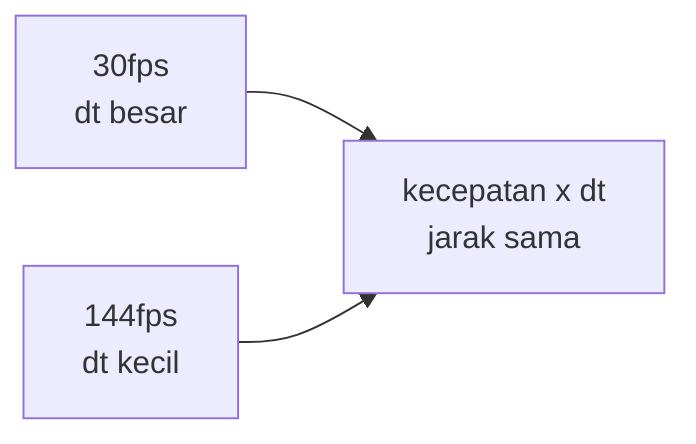

# Delta Time & Frame-Independent Movement

## Learning Objectives

Setelah lesson ini user mampu:

- Menjelaskan dengan kata sendiri kenapa gerakan harus dikali `dt`
- Menghitung `dt` dengan benar + membatasinya (clamp)
- Membuat gerakan yang sama cepat di 30fps maupun 144fps

## Concept

**fps** = jumlah gambar per detik. Laptop kentang: 30. Laptop gaming: 144. Masalah: kalau gerakan dihitung **per gambar** ("maju 5 pixel tiap frame"), pemain dengan layar mahal bergerak **lebih jauh per detiknya** — curang dan tidak adil.

Solusinya: hitung gerakan **per detik**, bukan per gambar. Caranya dengan `dt` — jeda antar frame dalam detik (di 60fps, dt ≈ 0.016). Rumus wajib game 2D:

```ts
posisi = posisi + kecepatan * dt; // kecepatan dalam pixel PER DETIK
```

Analogi: ojek dibayar **per kilometer**, bukan per langkah kaki. Langkah boleh kecil-kecil (144fps) atau besar-besar (30fps) — bayarannya (jarak per detik) tetap sama karena dikali tarif per km (`kecepatan`) dan jarak langkah (`dt`).

Satu pengaman wajib: **clamp** — batasi `dt` maksimal 0.05. Kenapa? Saat tab ditinggal 5 detik, frame berikutnya dt = 5 → karakter teleport 5 detik sekaligus. Clamp memotongnya: "jeda lebih dari 0.05 detik dianggap 0.05 saja."



## Why It Matters

Tanpa `dt`, game-mu mustahil di-balance: cepat di perangkatmu, lambat di HP muridmu. Semua angka tuning (speed, gravitasi, cooldown) menjadi tidak berarti. Dengan `dt`, "300 pixel per detik" benar-benar 300 di mana saja.

## Visual Explanation

Dua pelari: A melangkah 30x/detik dengan langkah 10px. B melangkah 144x/detik dengan langkah 2px. Siapa menang? Tanpa `dt`: B (288 vs 300... hitung: A = 30×10 = 300px/s, B = 144×2 = 288px/s — beda!). Dengan `dt`: keduanya didefinisikan "300px/s" → seri selalu, berapa pun langkahnya.

## Example

**Tingkat A — Lihat masalahnya (5 menit)**

```ts
// SALAH tapi sengaja: gerak per frame, tanpa dt
let xSalah = 0;
function loopSalah() {
  xSalah = xSalah + 5; // 5px per FRAME
  requestAnimationFrame(loopSalah);
}
// Di 60fps: 300px/detik. Di 144fps: 720px/detik! Tidak adil.
```

Ukur sendiri: tampilkan `x` setelah 2 detik di 2 perangkat (atau batasi fps via DevTools). Catat bedanya — inilah bug yang mau kita bunuh.

> Tanda berhasil: kamu bisa menjelaskan kenapa angka 2 perangkat beda.

**Tingkat B — Perbaiki dengan dt + clamp (inti lesson, 15 menit)**

```ts
let x = 0;
const SPEED = 300; // pixel PER DETIK — artinya jelas, bisa di-balance
let terakhir = performance.now();

function loop(sekarang: number) {
  let dt = (sekarang - terakhir) / 1000; // ms → detik! jangan lupa /1000
  terakhir = sekarang;
  dt = Math.min(dt, 0.05); // clamp: lebih dari ini dianggap 0.05

  x = x + SPEED * dt; // selalu pola ini

  requestAnimationFrame(loop);
}
requestAnimationFrame(loop);
```

Uji: gerakkan 2 detik → harus ≈600px di fps berapa pun.

> Tanda berhasil: jarak 2 detik sama (±20px) di semua perangkat/fps.

**Tingkat C — Cooldown ikut dt + intip fixed timestep (pendalaman, opsional)**

```ts
let tembakCd = 0;
function update(dt: number) {
  tembakCd = Math.max(0, tembakCd - dt); // BENAR: berkurang per detik
  // tembakCd = tembakCd - 1; // SALAH: habis dalam 60 frame (~1 dtk di 60fps, 0.4 dtk di 144fps)
}
```

Aturan: **semua yang berubah terhadap waktu** (posisi, timer, cooldown, animasi) wajib pakai `dt`. Tidak terkecuali.

> Fixed timestep (fisika 120Hz tetap, render bebas) adalah pendalaman — cukup tahu namanya. Perlu hanya jika tabrakan tetap tembus setelah clamp + substep (lihat lesson Collision).

## AI Coding with OpenCode

Minta AI mengaudit: cari semua gerakan/timer yang lupa `* dt` — tugas mekanis yang cocok untuk AI.

## Example Prompt

```text
You are a senior game developer.
Context: @src/*.ts — gerakan beda di 60 vs 144Hz.
Task: Cari semua update posisi/timer/cooldown yang TIDAK pakai dt, perbaiki + tambah clamp 0.05 di loop.
Constraints: Jangan ubah angka desain (speed tetap). Tampilkan daftar yang diperbaiki.
Acceptance Criteria: Kecepatan terukur (px/detik) sama di 2 refresh rate.
```

## Practical Exercise

1. **Pemanasan (5 menit):** jalankan Tingkat A, ukur jarak 2 detik. Tulis angkanya.
2. **Inti (15 menit):** ubah ke Tingkat B, ukur lagi. Bandingkan — harus konsisten.
3. **Cek pemahaman:** berburu di proyekmu — cari 3 tempat yang berubah terhadap waktu. Sudah pakai `dt` semua? Perbaiki yang belum.

## Challenge

Buat pengukur kecil: tampilkan `px/detik` aktual (jarak 1 detik terakhir) + FPS di layar. Lalu buka-tutup tab 5 detik — pastikan tidak ada teleport (clamp bekerja).

## Common Mistakes

| Gejala | Penyebab | Perbaikan |
|--------|----------|-----------|
| Gerakan super cepat (ribuan px) | `dt` masih milidetik (lupa `/1000`) | Bagi 1000 segera setelah hitung |
| Teleport setelah tab/lag | Tidak ada clamp | `dt = Math.min(dt, 0.05)` |
| Cooldown beda di tiap device | `timer -= 1` bukan `-= dt` | Semua timer pakai `dt` |
| Slow-motion saat lag berat | Clamp terlalu kecil (0.016) | 0.05 = kompromi umum (3 frame @60fps) |
| Tersendat padahal dt benar | Masalah di render (gambar berat) | Profil gambar dulu, bukan logika |

## Debugging

- **Ragu dt benar?** Log `dt` tiap detik: normal ≈0.016 (60fps). Sering >0.05 = perangkat/render keberatan — solusinya optimasi gambar, bukan utak-atik angka gerak.
- **Gerakan masih beda antar device?** Cari yang terlewat: `grep` pola `+= [0-9]` tanpa `dt` di belakangnya.

## Summary

Selalu `* dt`, selalu clamp 0.05, selalu ukur pixel/detik bukan pixel/frame. Tiga kebiasaan ini membuat semua angka game-mu jujur di semua perangkat.

## Next Lesson

→ `02-input-movement.md` — Input + Movement + Vector.
