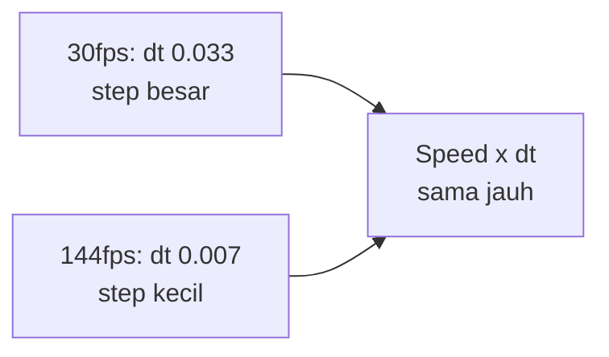

# Delta Time & Frame-Independent Movement

## Learning Objectives

Setelah lesson ini user mampu:

- Menghitung dt dengan benar + clamp
- Membuat gerakan konsisten 30fps vs 144fps
- Menjelaskan fixed vs variable timestep

## Concept

`dt` = detik sejak frame lalu. `x += speed * dt` artinya "kecepatan per detik", bukan per frame. Clamp (`min(dt, 0.05)`) mencegah teleport setelah lag/tab switch.

## Why It Matters

Tanpa dt, game-mu curang di monitor mahal dan lambat di HP kentang.

## Visual Explanation



## Example

```ts
// salah: 5px per frame → 300px/s di 60fps, 720px/s di 144fps
// x += 5;
// benar: 300px per detik di semua fps
x += 300 * dt;

// loop dengan clamp + fps meter
let last = performance.now(), fps = 60;
function loop(now: number) {
  let dt = (now - last) / 1000; last = now;
  dt = Math.min(dt, 0.05);
  fps = fps * 0.9 + (1 / Math.max(dt, 1e-4)) * 0.1;
  update(dt); render();
  requestAnimationFrame(loop);
}
```

## AI Coding with OpenCode

Minta AI audit: cari semua gerakan tanpa `* dt`.

## Example Prompt

```text
You are a senior game developer.
Context: @src/*.ts. Gerakan beda di 60 vs 144hz.
Task: Audit semua update movement, pastikan pakai dt, tambahkan clamp 0.05.
Constraints: Jangan ubah desain level. Tampilkan diff.
Acceptance Criteria: Kecepatan terukur sama (px/s) di 2 refresh rate.
```

## Practical Exercise

Ukur: gerakkan kotak 300px/s selama 2 detik → harus ~600px di fps berapapun.

## Challenge

Implement fixed timestep accumulator (update fisika 120Hz tetap, render variable) untuk collision stabil.

## Common Mistakes

- dt dalam ms (lupa /1000) → super cepat.
- Clamp terlalu kecil (0.016) → slow-motion saat lag.
- Timer/cooldown tidak pakai dt (`timer -= 1` bukan `timer -= dt`).

## Debugging

Gerakan tersendat? Log dt: jika spike >0.05 sering, masalah perf render, bukan logika. Profil render dulu.

## Summary

Selalu `* dt`, selalu clamp, ukur px/detik bukan px/frame.

## Next Lesson

→ `02-input-movement.md` — Input + Movement + Vector.
