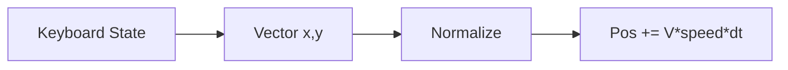

# Input, Movement & Vector

## Learning Objectives

Setelah lesson ini user mampu:

- Membuat input keyboard state (`keys: Set`) bukan event sekali
- Menghitung velocity dari vector + normalisasi diagonal
- Menerapkan akselerasi + friction sederhana

## Concept

Input = status tombol tiap frame, bukan event sesaat. Vector = (x,y) arah+besar. Gerakan diagonal tanpa normalisasi = 41% lebih cepat (Pythagoras). Solusi: normalize jika panjang >1.

## Why It Matters

Kontrol adalah rasa game. Input lag 100ms saja bikin game terasa murahan.

## Visual Explanation



## Example

```ts
const keys = new Set<string>();
addEventListener('keydown', e => keys.add(e.code));
addEventListener('keyup', e => keys.delete(e.code));

function getMoveVector() {
  let x = (keys.has('KeyD') ? 1 : 0) - (keys.has('KeyA') ? 1 : 0);
  let y = (keys.has('KeyS') ? 1 : 0) - (keys.has('KeyW') ? 1 : 0);
  const len = Math.hypot(x, y);
  if (len > 1) { x /= len; y /= len; }
  return { x, y };
}
function updatePlayer(dt: number) {
  const v = getMoveVector();
  player.x += v.x * 260 * dt;
  player.y += v.y * 260 * dt;
}
```

## AI Coding with OpenCode

Minta AI tambah gamepad/touch tanpa merusak keyboard, dengan abstraksi `getMoveVector()`.

## Example Prompt

```text
You are a senior game developer.
Context: @src/input.ts @src/player.ts. Keyboard WASD+Arrow sudah jalan.
Task: Tambahkan input touch (virtual joystick kiri) yang memetakan ke getMoveVector().
Constraints: Jangan ubah API getMoveVector. Pisahkan file touch.ts.
Acceptance Criteria: Jalan di mobile, keyboard tetap jalan, tidak ada duplikasi logika gerak.
```

## Practical Exercise

Tambahkan Arrow keys + cegah scroll (preventDefault untuk Space/Arrow).

## Challenge

Tambahkan akselerasi: `vx lerp ke target` + friction saat lepas tombol. Rasakan bedanya.

## Common Mistakes

- Pakai `keypress` sekali untuk gerak kontinu.
- Lupa normalisasi diagonal.
- Gerak langsung ubah `x` tanpa velocity → susah tambah knockback/friction.

## Debugging

Player bergerak sendiri? Cek focus + keyup hilang saat alt-tab. Solusi: clear `keys` saat `blur`.

## Summary

State tombol → vector → normalize → `* speed * dt`. Satu fungsi vector untuk semua device.

## Next Lesson

→ `03-collision.md` — Collision AABB.
