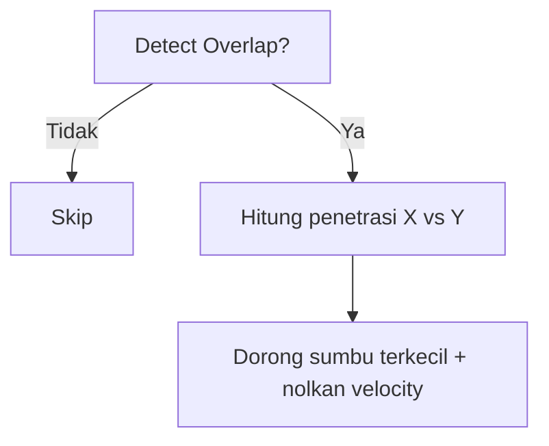

# Collision AABB & Resolusi Sederhana

## Learning Objectives

Setelah lesson ini user mampu:

- Menulis cek overlap AABB (kotak vs kotak)
- Memisahkan deteksi vs resolusi (dorong keluar)
- Mencegah tunneling dengan clamp/substep

## Concept

AABB = kotak sejajar sumbu (x,y,w,h). Overlap jika: `a.x < b.x+b.w && a.x+a.w > b.x && a.y < b.y+b.h && a.y+a.h > b.y`. Deteksi menjawab "kena?", resolusi menjawab "didorong ke mana?" — pilih sumbu penetrasi terkecil.

## Why It Matters

90% game 2D cukup AABB. Paham ini = bisa platformer, top-down, breakout tanpa engine fisika.

## Visual Explanation



## Example

```ts
type Box = { x: number; y: number; w: number; h: number };
function overlap(a: Box, b: Box) {
  return a.x < b.x + b.w && a.x + a.w > b.x && a.y < b.y + b.h && a.y + a.h > b.y;
}
function resolveAxis(player: Box & { vx: number; vy: number }, wall: Box) {
  const dx1 = (wall.x + wall.w) - player.x;       // dorong kanan
  const dx2 = (player.x + player.w) - wall.x;     // dorong kiri
  const dy1 = (wall.y + wall.h) - player.y;
  const dy2 = (player.y + player.h) - wall.y;
  const m = Math.min(dx1, dx2, dy1, dy2);
  if (m === dx1) { player.x = wall.x + wall.w; player.vx = 0; }
  else if (m === dx2) { player.x = wall.x - player.w; player.vx = 0; }
  else if (m === dy1) { player.y = wall.y + wall.h; player.vy = 0; }
  else { player.y = wall.y - player.h; player.vy = 0; }
}
```

Gerakkan X lalu cek, lalu Y lalu cek (split-axis) agar tidak nyangkut sudut.

## AI Coding with OpenCode

Minta AI buat `physics.ts` murni (tanpa canvas) + test overlap.

## Example Prompt

```text
You are a senior game developer.
Context: @src/player.ts movement sudah pakai dt + vector.
Task: Buatkan src/physics.ts: overlap(a,b), resolveAxis, moveAndCollide(body, walls, dt) split-axis.
Constraints: Tanpa library. Fungsi murni, testable.
Acceptance Criteria: tsc lolos, player tidak tembus wall tebal 16px pada speed 600px/s.
```

## Practical Exercise

Buat 1 wall + player bisa didorong, tidak tembus. Log sisi tumbukan (atas/bawah/kiri/kanan).

## Challenge

Tangani tunneling: jika `speed*dt > wall thickness`, bagi gerak jadi substep. Atau clamp dt sudah ada — buktikan kapan masih tembus.

## Common Mistakes

- Cek collision setelah render.
- Resolve langsung teleport ke tengah.
- Lupa nolkan velocity → jitter menempel tembok.

## Debugging

Nyangkut di sudut? Penyebab umum: resolve kedua sumbu sekaligus. Fix: split-axis X lalu Y. Tembol saat fps drop? Tambah substep.

## Summary

Deteksi = overlap boolean, resolusi = dorong sumbu terkecil. Split-axis + substep = stabil.

## Next Lesson

→ `05-game-design/01-core-loop.md` — Merancang Core Loop yang fun.
