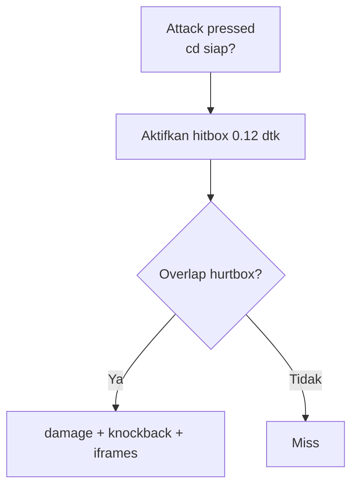

# Health, Damage & Attack

## Learning Objectives

Setelah lesson ini user mampu:

- Membuat HP, damage, cooldown, hitbox/hurtbox terpisah
- Menerapkan knockback + invincible (i-frames)
- Membedakan hitbox (memberi) vs hurtbox (menerima)

## Concept

Combat adil = **data** (hp, atk, cooldown) + **ruang** (hitbox hanya aktif 0.1 dtk saat ayun) + **waktu** (i-frames 0.5 dtk setelah kena). Hitbox menempel ke penyerang, hurtbox menempel ke badan — keduanya AABB biasa.

## Why It Matters

Serangan terasa "tidak kena" atau "kena padahal jauh" — masalah hitbox, bukan damage number.

## Visual Explanation



## Example

```ts
type Fighter = { x:number;y:number;w:number;h:number;hp:number;face:1|-1;atkCd:number;iframes:number;vx:number };
function attackBox(a: Fighter): {x:number;y:number;w:number;h:number} {
  return a.face === 1
    ? { x: a.x + a.w, y: a.y + 4, w: 36, h: 24 }
    : { x: a.x - 36, y: a.y + 4, w: 36, h: 24 };
}
function tryAttack(a: Fighter, b: Fighter) {
  if (a.atkCd > 0) return;
  a.atkCd = 0.4;
  const hb = attackBox(a);
  const hurt = { x: b.x, y: b.y, w: b.w, h: b.h };
  if (b.iframes <= 0 && overlap(hb, hurt)) {
    b.hp = Math.max(0, b.hp - 10);
    b.iframes = 0.5;
    b.vx = 220 * a.face; // knockback
    bus.emit('hit', { from: a, to: b });
  }
}
function tickCombat(f: Fighter, dt: number) {
  f.atkCd = Math.max(0, f.atkCd - dt);
  f.iframes = Math.max(0, f.iframes - dt);
}
```

Kedip saat iframes: `visible = iframes<=0 || Math.floor(t*20)%2===0`.

## AI Coding with OpenCode

Minta AI buat modul combat murni + test tanpa canvas.

## Example Prompt

```text
You are a senior game developer.
Context: @src/physics.ts ada overlap(). @src/player.ts, @src/enemy.ts punya x,y,w,h,hp.
Task: Buatkan src/combat.ts: tryAttack, tickCombat, attackBox. Pakai overlap existing.
Constraints: Tanpa ubah physics.ts. Fungsi murni + tipis.
Acceptance Criteria: tsc lolos, serangan 10 dmg kurangi hp benar, iframes blok hit kedua dalam 0.5 dtk.
```

## Practical Exercise

Tambahkan attack (J/klik) + render hitbox 0.12 dtk (kotak merah transparan) untuk debug, matikan nanti.

## Challenge

Tambahkan 3 jenis serangan via config: `{jab:{dmg:8,cd:0.3,range:30}, heavy:{dmg:20,cd:0.8,range:40}}`. Heavy ada windup 0.2 dtk (telegraph berkedip).

## Common Mistakes

- Hitbox selalu aktif → menyentuh musuh = kena terus.
- Damage tanpa cooldown/iframes → hp habis dalam 3 frame.
- Knockback langsung ubah `x` (teleport) bukan velocity → tembus wall.

## Debugging

"Kadang tidak kena padahal dekat"? Hitbox 1 frame pada 30fps bisa ke-skip. Aktifkan 0.1-0.15 dtk atau cek swept (kotak dari posisi lama→baru).

## Summary

Hitbox sesaat + hurtbox badan + cooldown + iframes + knockback velocity = combat terasa adil.

## Next Lesson

→ `06-enemy-ai.md` — Enemy AI & State Machine.
