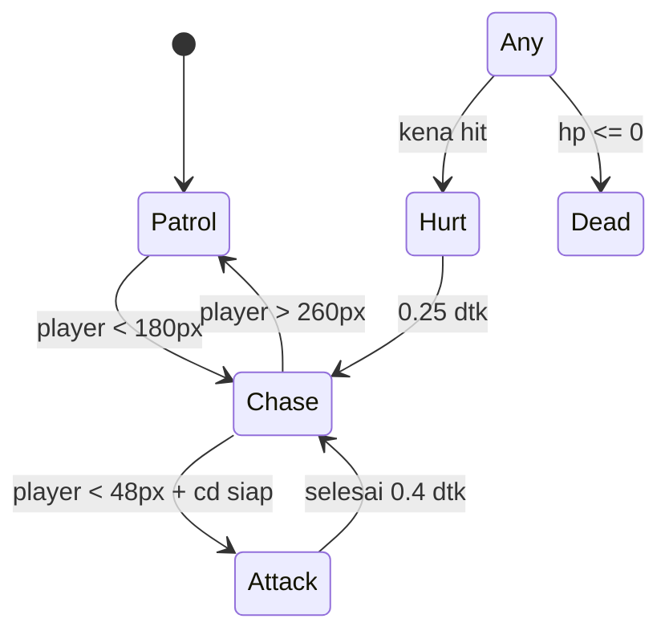

# Enemy AI & State Machine

## Learning Objectives

Setelah lesson ini user mampu:

- Membuat AI patrol → chase → attack → hurt → dead
- Menulis state machine eksplisit dengan transisi jelas
- Menghubungkan state ke animasi (Animation State)

## Concept

AI musuh = **sense** (jarak + garis pandang) → **decide** (state apa?) → **act** (gerak/serang). Tulis sebagai state + aturan pindah, bukan `if` bersarang 6 level. Fleksibel: tambah state baru tanpa bongkar yang lama.

## Why It Matters

Musuh "bodoh tapi adil" lebih fun daripada "pintar tapi curang" (lihat сквозь tembok, serang di luar layar).

## Visual Explanation



## Example

```ts
type EState = 'patrol'|'chase'|'attack'|'hurt'|'dead';
const e = { x:0, hp:30, state:'patrol' as EState, t:0, dir:1 as 1|-1, atkCd:0 };

function updateEnemy(e: typeof e, px: number, dt: number) {
  e.t += dt; e.atkCd = Math.max(0, e.atkCd - dt);
  const dist = Math.abs(px - e.x);
  switch (e.state) {
    case 'patrol':
      e.x += e.dir * 60 * dt;
      if (e.x > 400) e.dir = -1; if (e.x < 100) e.dir = 1;
      if (dist < 180) setState(e, 'chase');
      break;
    case 'chase':
      e.dir = px > e.x ? 1 : -1;
      e.x += e.dir * 120 * dt;
      if (dist > 260) setState(e, 'patrol');
      if (dist < 48 && e.atkCd <= 0) setState(e, 'attack');
      break;
    case 'attack':
      if (e.t > 0.4) { e.atkCd = 0.8; setState(e, 'chase'); }
      break;
    case 'hurt':
      if (e.t > 0.25) setState(e, 'chase');
      break;
  }
}
function setState(e: typeof e, s: EState) { e.state = s; e.t = 0; }
function hurt(e: typeof e) { if (e.state==='dead') return; setState(e, 'hurt'); }
```

Aturan adil: jangan serang dari luar layar, beri telegraph 0.3 dtk (berkedip/bersuara) sebelum damage.

## AI Coding with OpenCode

Minta AI ubah `if` bersarang jadi state machine + config tuning.

## Example Prompt

```text
You are a senior game developer.
Context: @src/enemy.ts AI masih if-else kedalaman 5, susah tuning.
Task: Refactor ke state machine patrol/chase/attack/hurt/dead + ENEMY config (speed, range, dmg).
Constraints: Perilaku luar sama, hanya struktur berubah. Satu file.
Acceptance Criteria: tsc lolos, musuh tidak serang di luar layar, ada telegraph sebelum hit.
```

## Practical Exercise

Tambahkan `idle` 1 dtk di tiap ujung patrol (musuh berhenti, menoleh). Rasakan bedanya — langsung lebih hidup.

## Challenge

Buat 2 tipe via config: Slime (lambat, hp tebal) + Bat (cepat, hp tipis, gerak sinus Y). Satu `updateEnemy`, beda data.

## Common Mistakes

- Chase tanpa batas leash → musuh kejar sampai ujung map.
- Attack instan tanpa telegraph → terasa curang.
- State tanpa timer reset → terjebak di `hurt` selamanya.

## Debugging

Musuh bergetar di batas range? Itu flicker patrol↔chase. Fix: hysteresis (masuk 180, keluar 260 — beda angka, seperti di contoh).

## Summary

Sense → state → act + telegraph + hysteresis = AI sederhana yang fun dan adil.

## Next Lesson

→ `07-spawn-item.md` — Spawn & Inventory. Atau lompat ke `08-quest-save.md` jika butuh save dulu (fleksibel).
