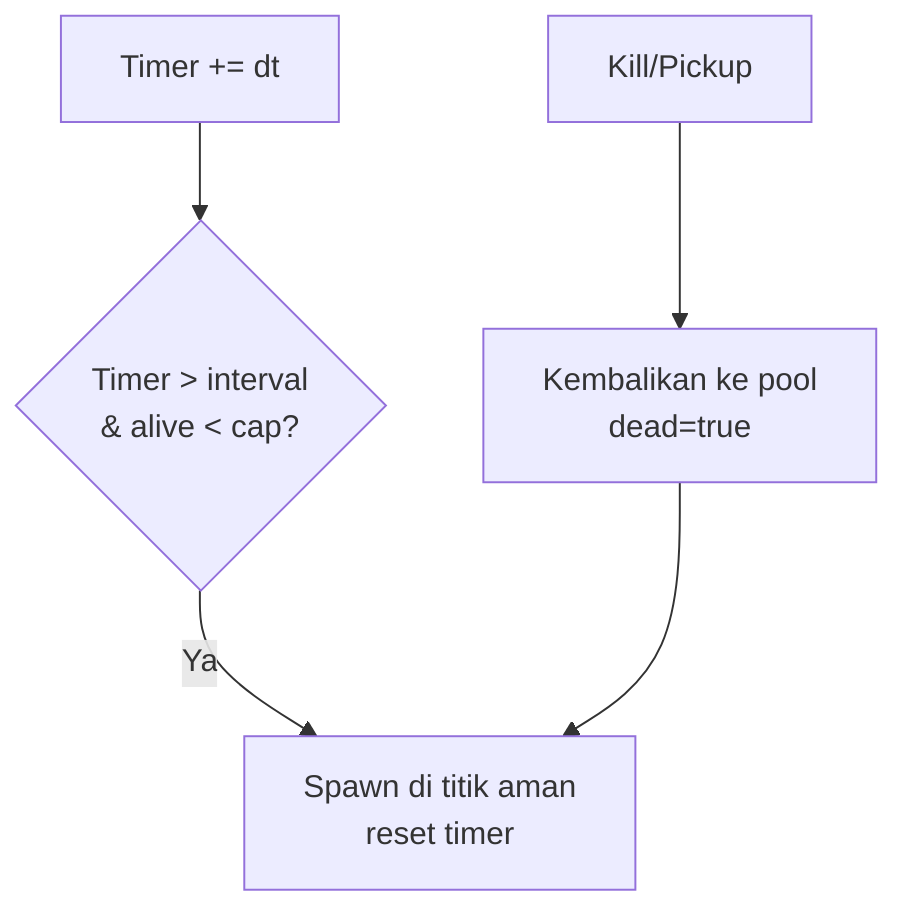

# Spawn System & Inventory

## Learning Objectives

Setelah lesson ini user mampu:

- Membuat spawner interval + wave + batas maksimal
- Memakai object pooling agar tidak GC-spike
- Membuat inventory & item pickup data-driven

## Concept

Spawn = **kapan** (timer/wave) + **di mana** (titik aman) + **berapa** (cap). Pooling = daur ulang objek mati (peluru, partikel) daripada `new` terus. Inventory = array item + efek, item cukup data (`{id, name, heal}`) bukan class per item.

## Why It Matters

Spawn tanpa cap → 500 musuh → fps 5. `new` tiap frame → stutter tiap detik. Inventory hardcode → tambah 1 potion harus ubah 5 file.

## Visual Explanation



## Example

```ts
// spawner fleksibel
const spawner = { t: 0, interval: 2, cap: 12, alive: 0 };
function updateSpawner(dt: number, spawn: () => void) {
  spawner.t += dt;
  if (spawner.t >= spawner.interval && spawner.alive < spawner.cap) {
    spawner.t = 0; spawner.alive++; spawn();
  }
}

// pooling sederhana
type Bullet = { x:number; y:number; vx:number; dead:boolean };
const pool: Bullet[] = Array.from({length: 64}, () => ({x:0,y:0,vx:0,dead:true}));
function fire(x:number,y:number) {
  const b = pool.find(b => b.dead); if (!b) return; // pool penuh → skip, jangan crash
  b.x=x; b.y=y; b.vx=400; b.dead=false;
}

// inventory data-driven
const ITEMS: Record<string,{name:string;heal?:number;atk?:number}> = {
  potion: { name:'Potion', heal:30 },
  sword: { name:'Iron Sword', atk:5 },
};
let inv: string[] = [];
function pickup(id: string) { if (ITEMS[id]) inv.push(id); }
function useItem(i: number, hp: {v:number}) {
  const it = ITEMS[inv[i]]; if (!it) return;
  if (it.heal) hp.v = Math.min(100, hp.v + it.heal);
  inv.splice(i,1);
}
```

Spawn aman: pilih titik jauh >200px dari player + di dalam layar.

## AI Coding with OpenCode

Minta AI tambah pooling + cap tanpa ubah API spawn.

## Example Prompt

```text
You are a senior game developer.
Context: @src/enemy.ts @src/bullet.ts. Spawn new tiap kali, fps drop saat ramai.
Task: Tambahkan pool 64 untuk bullet + cap 12 untuk enemy + spawn aman jauh dari player.
Constraints: API spawn() tetap sama. Tanpa lib.
Acceptance Criteria: tsc lolos, 60 detik ramai tanpa stutter, tidak ada spawn di atas player.
```

## Practical Exercise

Ubah interval spawn jadi adaptif: `interval = max(0.5, 2 - wave*0.2)`. Naikkan wave tiap 30 detik.

## Challenge

Tambahkan loot table: musuh 60% coin (+10 skor), 25% potion, 15% nothing. Pakai 1 fungsi `rollLoot()` yang bisa dites tanpa canvas.

## Common Mistakes

- Spawn di posisi player → mati instan tanpa salah.
- Pool tidak pernah dikembalikan (`dead` tidak di-set) → pool habis dalam 10 detik.
- Inventory simpan objek berat + fungsi → susah save/load. Simpan id string saja.

## Debugging

FPS drop bertahap? Log `alive` + `pool free`. Jika alive naik terus, despawn tidak jalan (lupa `alive--` saat mati/keluar layar).

## Summary

Timer + cap + titik aman + pool + item-sebagai-data = sistem spawn/inventory yang tahan ramai dan mudah diperluas.

## Next Lesson

→ `08-quest-save.md` — Quest & Save. Atau ke Project 02 jika mau langsung bangun.
