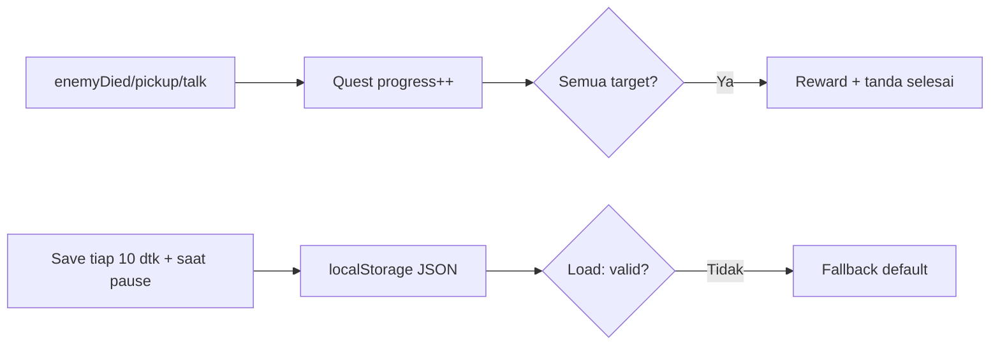

# Quest & Save System

## Learning Objectives

Setelah lesson ini user mampu:

- Membuat quest kill/collect/talk dengan progress + reward
- Menyimpan dan memuat progres (localStorage + JSON aman)
- Menangani save korup tanpa crash

## Concept

Quest = **tujuan + progress + selesai + hadiah**, digerakkan event (`enemyDied`, `pickup`, `talk`). Save = snapshot kecil (hp, wave, inv ids, quest states) → `JSON.stringify` → localStorage. Load = `try/catch` + validasi + fallback default.

## Why It Matters

Pemain kembali karena progres tidak hilang. Save korup yang bikin crash = review bintang 1.

## Visual Explanation



## Example

```ts
type Quest = { id:string; title:string; need:number; have:number; done:boolean; reward:{score:number} };
const quests: Quest[] = [
  { id:'q_kill3', title:'Kalahkan 3 slime', need:3, have:0, done:false, reward:{score:200} },
];
bus.on('enemyDied', () => {
  for (const q of quests) {
    if (q.done || q.id !== 'q_kill3') continue;
    q.have++;
    if (q.have >= q.need) { q.done = true; score += q.reward.score; bus.emit('questDone', q); }
  }
});

// save aman & fleksibel (versi + validasi)
const SAVE_KEY = 'neon-breakout-save-v1';
function saveGame(data: unknown) {
  try { localStorage.setItem(SAVE_KEY, JSON.stringify({ v:1, at:Date.now(), data })); } catch {}
}
function loadGame<T>(fallback: T): T {
  try {
    const raw = localStorage.getItem(SAVE_KEY); if (!raw) return fallback;
    const p = JSON.parse(raw);
    if (!p || p.v !== 1 || !p.data) return fallback;
    return { ...fallback, ...p.data };
  } catch { return fallback; }
}
```

Simpan kecil: `{ hp, wave, score, inv: string[], questsDone: string[] }`. Jangan simpan fungsi/pool.

## AI Coding with OpenCode

Minta AI buat quest + save terpisah yang tidak mengunci game.

## Example Prompt

```text
You are a senior game developer.
Context: @src/main.ts @src/events.ts ada Bus. Belum ada quest/save.
Task: Buatkan src/quest.ts (3 quest: kill3, coin10, talk1) + src/save.ts (save/load versi + validasi).
Constraints: Quest dengar event, jangan ubah combat. Save max 1KB.
Acceptance Criteria: tsc lolos, reload lanjut progres, save korup manual tetap jalan default.
```

## Practical Exercise

Tambahkan NPC bicara (E) → `bus.emit('talk', {npc:'elder'})` → quest talk selesai → reward potion.

## Challenge

Autosave tiap 10 detik + saat `visibilitychange` (tab disembunyikan). Tampilkan "Saved ✓" 1 detik tanpa ganggu main.

## Common Mistakes

- Save tiap frame → localStorage penuh + lag.
- Load langsung `as GameData` tanpa validasi → crash jika field hilang.
- Quest hardcode per musuh → tambah quest = ubah combat.

## Debugging

Progres hilang setelah reload? Cek: (1) `saveGame` tidak pernah dipanggil (hanya di memori), (2) key beda versi, (3) private mode blokir localStorage → bungkus `try/catch`.

## Summary

Event → quest → reward + save kecil berversi + load defensif = game yang pantas dimainkan lama.

## Next Lesson

→ `05-game-design/02-difficulty-balancing.md` — Difficulty & Balancing.
