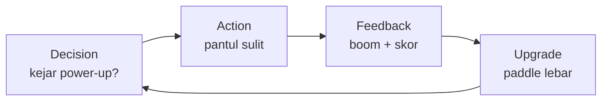

# Merancang Core Loop yang Fun

## Learning Objectives

Setelah lesson ini user mampu:

- Menulis core loop 1 kalimat + diagram
- Menambahkan risk-vs-reward + progression 3 menit
- Playtest 60 detik dan mencatat temuan

## Concept

Core loop fun = **keputusan tiap 10 detik + feedback tiap 2 detik + upgrade tiap 2 menit**. Tiga bumbu: tujuan jelas, risiko terukur, reward langsung (juice: partikel, suara, shake).

## Why It Matters

Breakout tanpa juice membosankan. Dengan partikel + pitch suara naik tiap combo, game yang sama terasa 3x lebih fun.

## Visual Explanation



## Example

Breakout membosankan → fun:

```text
Before: pantul → hancur → skor.
After: pantul → combo x2..x8 (pitch naik) → pilih: ambil power-up jauh (risiko bola hilang) → paddle api 10 detik → boss tiap 3 level.
```

## AI Coding with OpenCode

Minta AI jadi playtester kejam: cari momen bosan + usulkan 1 tweak terkecil.

## Example Prompt

```text
You are a senior game designer + playtester.
Context: Core loop saya: pantul bola, hancurkan bata, kumpulkan skor, 3 nyawa.
Task: Kritik: di detik berapa pemain bosan? Usulkan 2 tweak minimal (tanpa tambah scope besar).
Constraints: Tetap Breakout 1 level. Fokus juice + risk-reward.
Acceptance Criteria: Tabel detik 0-60: aksi/emosi pemain + 2 usulan prioritas.
```

## Practical Exercise

Mainkan 1 game favorit 5 menit, catat tiap 30 detik: apa keputusanmu? Apa rewardnya?

## Challenge

Tambahkan combo ke project-mu: hancur cepat beruntun = multiplier + pitch SFX naik. Hilang saat bola menyentuh paddle.

## Common Mistakes

- Menambah fitur saat masalahnya kurang juice.
- Reward telat (upgrade 10 menit sekali).
- Tidak ada risiko → tidak ada adrenalin.

## Debugging

Pemain diam 20 detik? Tujuan tidak jelas. Tambahkan panah/tutorial 5 detik + reward pertama dalam 10 detik.

## Summary

Fun = keputusan cepat + feedback instan + progression singkat. Juice dulu, fitur kemudian.

## Next Lesson

→ `10-projects/project-01.md` — Project 01: Breakout.
