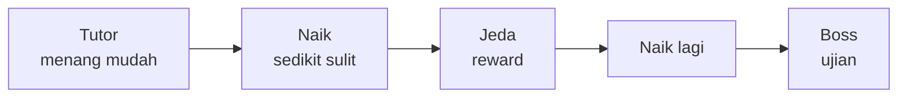

# Difficulty, Reward & Balancing

## Learning Objectives

Setelah lesson ini user mampu:

- Menggambar kurva kesulitan yang adil (naik + istirahat)
- Memakai risk-vs-reward dan jadwal reward 2 menit
- Men-balancing 1 angka dalam 10 menit playtest

## Concept

Kesulitan bagus = **tantangan naik perlahan + jeda bernapas + reward tepat waktu**. Formula fleksibel: `tantangan = jumlah × kecepatan × HP / (power pemain)`. Ubah 1 variabel sekali, test, catat — jangan ubah 5 sekaligus.

## Why It Matters

Game terlalu mudah = bosan. Terlalu sulit di 60 detik pertama = uninstall. 80% retensi ditentukan 3 menit pertama.

## Visual Explanation



Jadwal reward: tiap 10 dtk (skor/efek) → tiap 2 mnt (upgrade) → tiap 10 mnt (unlock).

## Example

Breakout balancing:

| Wave | Speed | Baris | Nyawa | Alasan |
|------|-------|-------|-------|--------|
| 1 | 300 | 2 | 3 | Menang dalam 60 dtk, pede |
| 2 | 340 | 3 | 3 | Sedikit menantang |
| 3 | 380 + bola cepat | 3 + bata 2HP | +1 nyawa reward | Ujian + hadiah |

Risk-vs-reward contoh: power-up jauh dari paddle (risiko bola hilang) tapi efek 2x skor 10 dtk.

```ts
// 1 angka tuning terpusat — fleksibel diubah tanpa bongkar kode
export const BALANCE = { ballSpeed: 320, speedPerWave: 30, paddleW: 90, lives: 3 };
```

## AI Coding with OpenCode

Minta AI jadi balancer: usulkan 3 preset + cara ukur.

## Example Prompt

```text
You are a senior game designer.
Context: Breakout saya wave 1 terlalu mudah, wave 2 terlalu sulit. BALANCE di @src/config.ts.
Task: Usulkan Easy/Normal/Hard (speed, jumlah, nyawa) + metrik sukses (misal: menang wave1 >80% dalam 90 dtk).
Constraints: Ubah angka saja, tanpa fitur baru.
Acceptance Criteria: Tabel 3 preset + 1 cara ukur per preset.
```

## Practical Exercise

Minta 3 teman main wave 1. Catat: menang? berapa detik? bosan di detik berapa? Ubah 1 angka, ulangi.

## Challenge

Tambahkan dynamic difficulty ringan: kalah 2x beruntun → speed -10% sementara + tampilkan "Assist mode". Matikan saat menang.

## Common Mistakes

- Buff musuh + nerf pemain bersamaan → tidak tahu mana yang berpengaruh.
- Reward 10 menit sekali → pemain pergi sebelum merasakannya.
- Boss tanpa checkpoint → frustasi, bukan tantangan.

## Debugging

Keluhan "sulit" biasanya: (1) tujuan tidak jelas, (2) damage spike tiba-tiba, (3) tidak ada jeda. Fix termurah: tambah 1 nyawa + kurangi speed 10% + tambah telegraph — test lagi.

## Summary

Naik pelan + jeda + reward cepat + ubah 1 angka sekali = balancing tanpa drama.

## Next Lesson

→ `03-level-design.md` — Level Design. Atau ke Architecture jika mau rapikan kode dulu.
