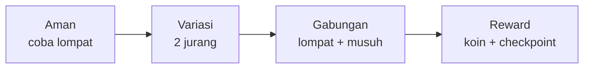

# Level Design & Pacing

## Learning Objectives

Setelah lesson ini user mampu:

- Menyusun level: ajarkan → latih → uji → istirahat
- Membuat tutorial tanpa teks panjang
- Menyiapkan playtest checklist 5 menit

## Concept

Level bagus mengajarkan lewat **ruang**, bukan paragraf. Pola: perkenalkan 1 ide di tempat aman → beri 2-3 tantangan variasi → uji gabungan → beri reward/istirahat. Fleksibel untuk platformer, top-down, maupun Breakout.

## Why It Matters

Pemain skip tutorial teks. Mereka ingat apa yang mereka *lakukan*, bukan apa yang mereka *baca*.

## Visual Explanation



## Example

Level 1 platformer 60 detik:

```text
0-10 dtk: tanah datar + 1 jurang kecil (paksa lompat, tidak bisa mati)
10-25 dtk: 3 platform naik + koin di atas (ajari arah)
25-40 dtk: 1 slime lambat + tempat tinggi aman (ajari serang tanpa risiko)
40-55 dtk: jurang + slime (gabungan, checkpoint di tengah)
55-60 dtk: bendera + fanfare (reward jelas)
```

Aturan praktis: reward pertama <10 dtk, kematian pertama tidak mungkin sebelum 20 dtk, checkpoint tiap 30-45 dtk.

## AI Coding with OpenCode

Minta AI review sketsa level-mu sebagai playtester.

## Example Prompt

```text
You are a senior level designer.
Context: Level 1 saya: datar 10 dtk, 3 platform, 1 slime, jurang+slime, bendera. Target pemain baru.
Task: Kritik pacing: di mana bosan? di mana frustasi? Usulkan 2 pindah platform/koin minimal.
Constraints: Tetap 1 level, tanpa musuh baru.
Acceptance Criteria: Timeline 0-60 dtk: aksi/emosi + 2 usulan prioritas.
```

## Practical Exercise

Gambar level di kertas/kotak: 5 zona (aman→variasi→gabungan→reward). Foto, lalu bangun di kode sebagai data (`platforms: [{x,y,w}]`), bukan hardcode gambar.

## Challenge

Buat level sebagai data + 2 varian: `LEVELS = [level1, level1_mirror]`. Ganti level tanpa ubah kode gerak.

## Common Mistakes

- Tutorial 2 menit teks sebelum boleh main.
- 3 ide baru sekaligus di 10 detik pertama.
- Tidak ada checkpoint → ulang 2 menit untuk 5 detik kesalahan.

## Debugging

Pemain tersesat? Tambahkan: panah/koin penunjuk arah, kamera lihat ke depan gerak, 1 jalur utama jelas + 1 jalur rahasia opsional.

## Summary

Satu ide sekali + aman dulu + checkpoint sering = level yang mengajarkan sendiri.

## Next Lesson

→ `06-architecture/01-folder-modular.md` — Rapikan struktur.
