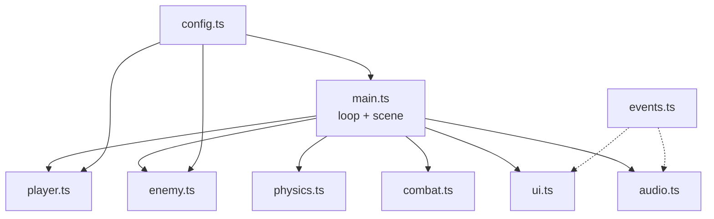

# Folder Structure & Modular Architecture

## Learning Objectives

Setelah lesson ini user mampu:

- Menyusun folder game kecil yang rapi (<10 file)
- Memisahkan config, state, logic, render, audio, UI
- Tahu kapan sederhana lebih baik dari kompleks

## Concept

Arsitektur = **di mana taruh apa + siapa boleh panggil siapa**. Aturan fleksibel: `main.ts` orkestrasi saja (<100 baris), tiap modul 1 tanggung jawab, config terpusat, tidak ada import melingkar. Jangan ECS penuh untuk game 1 level.

## Why It Matters

Struktur rapi bikin AI (dan kamu 2 minggu lagi) tidak tersesat. Struktur over-engineering bikin 3 hari setup untuk game 3 hari.

## Visual Explanation



## Example

```text
breakout/
├── index.html
├── src/main.ts      # loop, scene, orkestrasi (<100 baris)
├── src/config.ts    # BALANCE: semua angka tuning
├── src/input.ts     # keyboard + touch → vector
├── src/physics.ts   # overlap, resolve (murni, testable)
├── src/paddle.ts    # entity + update
├── src/ball.ts
├── src/bricks.ts
├── src/combat.ts    # jika ada serangan
├── src/ui.ts        # HUD + overlay (dengar event)
├── src/audio.ts     # WebAudio beep (dengar event)
├── src/events.ts    # Bus singleton
└── AGENTS.md        # aturan AI
```

`config.ts`:

```ts
export const BALANCE = { ballSpeed: 320, paddleW: 90, lives: 3, gravity: 2200 };
```

Kapan naik level: >15 file / >3 tipe musuh / save kompleks → pecah jadi `entities/`, `systems/`, `managers/`. Belum sampai sana? Jangan.

## AI Coding with OpenCode

Minta AI audit struktur + usulkan pindahan minimal.

## Example Prompt

```text
You are a senior game architect.
Context: @src/ (10 file, main.ts 180 baris campur UI/SFX).
Task: Usulkan struktur modular: file apa dipecah, apa tetap. Tunjukkan pindahan minimal.
Constraints: Max 12 file. Jangan ECS penuh. Perilaku sama.
Acceptance Criteria: main.ts <100 baris, tidak ada circular import, tsc lolos.
```

## Practical Exercise

Pindahkan semua angka tuning ke `config.ts`. Lalu minta AI verifikasi tidak ada magic number tersisa.

## Challenge

Tambahkan `src/save.ts` + `src/quest.ts` tanpa menyentuh `physics.ts`/`combat.ts` (bukti modularitas). Jika harus sentuh, struktur belum benar.

## Common Mistakes

- Satu `game.ts` 800 baris.
- `player.ts` import `ui.ts` dan `ui.ts` import `player.ts` (circular).
- Bikin `core/engine/` abstrak untuk game pertama.

## Debugging

Import error melingkar? Gambar panah import. Aturan: entity → physics/config saja; UI/audio → events saja; main → semua. Tidak boleh sebaliknya.

## Summary

Sedikit file + 1 tugas per file + config pusat + main tipis = fleksibel tumbuh tanpa rewrite.

## Next Lesson

→ `02-ecs-state-event.md` — ECS-lite & Managers.
