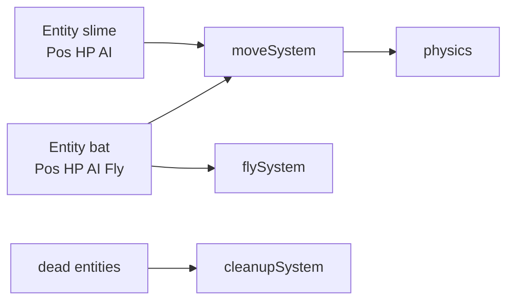

# ECS-lite, State & Event Managers

## Learning Objectives

Setelah lesson ini user mampu:

- Memakai pola Entity + Component (data) + System (logic)
- Membuat Manager tipis: Game, Scene, Audio, Save, UI
- Memilih: kapan class cukup, kapan ECS-lite perlu

## Concept

**Entity** = id + kumpulan component. **Component** = data polos (`{hp}`, `{vel}`), tanpa logic. **System** = fungsi yang jalan untuk semua entity ber-component cocok (`updateHealth`, `updateMove`). Manager = 1 objek per urusan global. Fleksibel: mulai class, pindah ECS-lite hanya saat duplikasi logika 3+ tipe entity.

## Why It Matters

3 tipe musuh dengan `if type==='bat'` di mana-mana = tambah 1 tipe = ubah 6 file. ECS-lite: tambah data + 1 system kecil.

## Visual Explanation



## Example

```ts
type Entity = { id:number; pos?:{x:number;y:number;vx:number;vy:number}; hp?:{v:number;max:number}; ai?:{kind:'slime'|'bat'}; dead?:boolean };
let nextId = 1;
const world: Entity[] = [];
function spawn(e: Omit<Entity,'id'>) { world.push({ ...e, id: nextId++ }); }

function moveSystem(dt: number) {
  for (const e of world) {
    if (!e.pos || e.dead) continue;
    e.pos.x += e.pos.vx * dt; e.pos.y += e.pos.vy * dt;
  }
}
function damageSystem(id: number, n: number) {
  const e = world.find(e => e.id === id); if (!e?.hp || e.dead) return;
  e.hp.v -= n; if (e.hp.v <= 0) { e.dead = true; bus.emit('entityDied', e); }
}
function cleanupSystem() {
  for (let i = world.length-1; i >= 0; i--) if (world[i].dead && world[i].hp) { /* keep corpse? or */ }
}

// Manager tipis contoh
export const AudioMan = {
  ctx: null as AudioContext | null,
  beep(f=440) { /* ... */ },
};
```

Aturan: system tidak render, render tidak update. Scene manager cukup `switchScene('menu'|'game'|'over')` yang clear world + pasang entity awal.

## AI Coding with OpenCode

Minta AI migrasi bertahap class → ECS-lite hanya untuk bagian duplikat.

## Example Prompt

```text
You are a senior game architect.
Context: @src/enemy.ts @src/player.ts banyak duplikasi hp/move/dead.
Task: Rancang migrasi ECS-lite minimal: Entity type + moveSystem + damageSystem. Tunjukkan tahap 1 saja (tanpa hapus class lama).
Constraints: Game tetap jalan tiap tahap. Max 2 file baru.
Acceptance Criteria: Plan tahap + kode tahap 1 + cara rollback.
```

## Practical Exercise

Ubah 2 tipe musuh jadi data: `spawn({pos, hp:{v:20}, ai:{kind:'slime'}})` vs `bat`. Satu `moveSystem` menangani keduanya.

## Challenge

Tambahkan `saveSystem`: serialize `world` (pos+hp+ai, tanpa fungsi) → load kembali. Buktikan ECS-lite mudah di-save.

## Common Mistakes

- Component berisi fungsi/logic → tidak bisa di-save/clone.
- System saling panggil berurutan aneh → tentukan order tetap di `main.ts`.
- ECS penuh dengan query generik untuk game 1 level (overkill).

## Debugging

Entity hilang/tidak gerak? Cek: (1) component kurang (`pos` undefined → system skip diam-diam), (2) `dead` tidak pernah cleanup → world membesar. Log `world.length` + validasi spawn.

## Summary

Data polos + system kecil + manager tipis = tambah konten tanpa tambah kusut. Naik ke ECS penuh hanya jika world >50 entity aktif.

## Next Lesson

→ `07-assets/01-sprite-animation.md` — Sprite & Animasi.
