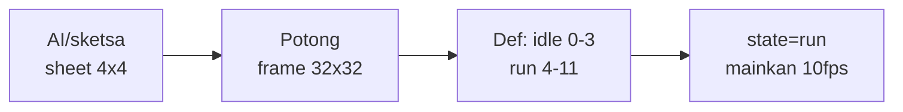

# Sprite, Tileset & Animasi

## Learning Objectives

Setelah lesson ini user mampu:

- Membedakan sprite, sprite sheet, tileset, texture
- Memotong sheet jadi frame + mainkan animasi state
- Membuat tileset level sederhana dari grid

## Concept

**Sprite** = 1 gambar. **Sheet** = banyak frame dalam 1 file (hemat load). **Tileset** = potongan level berulang (rumput, tembok). **Animasi** = ganti frame tiap X detik sesuai state (`run` cepat, `idle` lambat). Alur fleksibel: AI generate/sketsa → potong → definisi frame → hubungkan ke state.

## Why It Matters

1 file sheet + kode animasi 20 baris = karakter hidup. 20 file PNG + `if` manual = mimpi buruk load + bug frame.

## Visual Explanation



## Example

```ts
// animasi generik: fleksibel untuk player, slime, koin
type Anim = { frames: number[]; fps: number; loop: boolean };
const ANIMS: Record<string, Anim> = {
  idle: { frames: [0,1,2,3], fps: 6, loop: true },
  run: { frames: [4,5,6,7,8,9], fps: 10, loop: true },
  hit: { frames: [12,13], fps: 12, loop: false },
};
const animState = { name: 'idle', t: 0, i: 0 };
function updateAnim(dt: number, want: string) {
  if (want !== animState.name) { animState.name = want; animState.t = 0; animState.i = 0; }
  const a = ANIMS[want];
  animState.t += dt;
  const dur = 1 / a.fps;
  while (animState.t >= dur) {
    animState.t -= dur; animState.i++;
    if (animState.i >= a.frames.length) animState.i = a.loop ? 0 : a.frames.length - 1;
  }
}
function frameIndex() { return ANIMS[animState.name].frames[animState.i]; }
// gambar: drawImage(sheet, (fi%cols)*32, floor(fi/cols)*32, 32,32, x,y, 32,32)
```

Tileset: `level = [[1,1,1],[1,0,2]]` → `tileAt(col,row)` → gambar tile + collision jika solid.

Prompt AI asset contoh: `"2D pixel sprite sheet, slime green, 4 idle frames, side view, plain background, 32x32 per frame, consistent"`.

## AI Coding with OpenCode

Minta AI buat loader + animasi generik dari sheet-mu.

## Example Prompt

```text
You are a senior game developer.
Context: @src/player.ts gerak sudah jalan (kotak). Saya punya sheet.png 8x2 frame 32px.
Task: Buatkan src/anim.ts generik (ANIMS + updateAnim + frameIndex) + integrasi player (idle/run/hit).
Constraints: Jangan ubah fisika. Fallback kotak jika gambar gagal load.
Acceptance Criteria: tsc lolos, animasi ganti sesuai state, tidak flicker.
```

## Practical Exercise

Ganti 1 kotak jadi sprite: load 1 PNG, gambar dengan `drawImage`. Lalu perluas jadi 4-frame idle.

## Challenge

Buat tileset 3 tile (tanah, tembok, koin) + level 20x10 dari string:

```text
####################
#..................#
#..o....##.....o...#
####################
```

`#`=solid, `o`=koin.

## Common Mistakes

- Tiap frame file terpisah → loading lambat + nama berantakan.
- Animasi di-update dengan `frame++` per render (tanpa dt/fps) → beda kecepatan tiap device.
- Sheet tidak konsisten ukuran → potongan bergeser.

## Debugging

Frame melompat/blank? Cek: (1) `cols` salah, (2) gambar belum `onload` tapi sudah digambar (tampilkan fallback dulu), (3) state berubah tiap frame (`want` flicker idle↔run karena threshold velocity 0).

## Summary

Satu sheet + definisi anim + hubungkan ke state + fallback = visual hidup yang tahan ganti aset.

## Next Lesson

→ `02-audio-optimization.md` — Audio & Optimasi.
