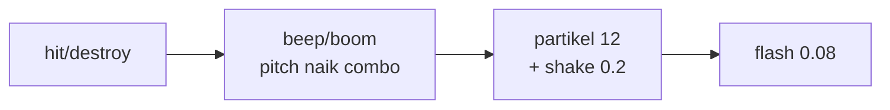

# Audio, VFX & Optimasi Asset

## Learning Objectives

Setelah lesson ini user mampu:

- Membuat SFX WebAudio tanpa file (beep, boom)
- Menambah juice: partikel + screen shake + flash
- Mengoptimasi ukuran dan jumlah asset

## Concept

Juice murah = **suara tepat + gerak kecil + kilat singkat**. SFX via oscillator (bip) + noise (ledakan) cukup untuk MVP. Partikel = pool kotak kecil ber-velocity + gravitasi + fade. Shake = offset kamera acak 0.2 dtk. Optimasi = sheet gabungan + audio pendek + lazy load per scene.

## Why It Matters

Game sama dengan juice terasa 3x lebih mahal. Tanpa optimasi, 50MB PNG + 10MB wav = load 20 detik di HP.

## Visual Explanation



## Example

```ts
// SFX tanpa file — fleksibel, langsung jalan
let actx: AudioContext | null = null;
function beep(freq = 440, dur = 0.08, type: OscillatorType = 'square', vol = 0.15) {
  try {
    actx ??= new AudioContext();
    const o = actx.createOscillator(), g = actx.createGain();
    o.type = type; o.frequency.value = freq;
    g.gain.value = vol;
    o.connect(g).connect(actx.destination);
    o.start(); o.stop(actx.currentTime + dur);
  } catch {}
}
function hitSound(combo = 1) { beep(300 + combo * 60, 0.07); } // pitch naik
function boomSound() { beep(120, 0.25, 'sawtooth', 0.2); }

// partikel pool
type P = { x:number;y:number;vx:number;vy:number;life:number;max:number };
const parts: P[] = [];
function burst(x:number,y:number,n=12) {
  for (let i=0;i<n;i++) parts.push({ x, y, vx:(Math.random()-0.5)*300, vy:(Math.random()-0.7)*300, life:0.5, max:0.5 });
}
function updateParts(dt:number) {
  for (const p of parts) { p.life-=dt; p.vy+=800*dt; p.x+=p.vx*dt; p.y+=p.vy*dt; }
  for (let i=parts.length-1;i>=0;i--) if (parts[i].life<=0) parts.splice(i,1);
}
let shake = 0;
function addShake(n=6) { shake = Math.max(shake, n); }
// saat render: ctx.translate((Math.random()-0.5)*shake, ...) lalu shake = max(0, shake - 40*dt)
```

Optimasi checklist: gabung PNG → sheet, maksimal 2048px, audio <500KB (atau sintesis), hapus asset tak dipakai, kompres sebelum build.

## AI Coding with OpenCode

Minta AI tambah juice terpusat tanpa sentuh logika inti.

## Example Prompt

```text
You are a senior game developer.
Context: @src/main.ts @src/combat.ts. Combat jalan tapi kering.
Task: Buatkan src/juice.ts (burst, addShake, hitSound/boomSound) + hubungkan ke event hit/destroy.
Constraints: Hanya tambah listener + 1 panggil render. Jangan ubah damage.
Acceptance Criteria: tsc lolos, tiap hit ada suara+partikel, tidak ada fps drop 30 dtk.
```

## Practical Exercise

Tambahkan: hancur → `burst + boomSound + shake 6`, hit biasa → `beep + shake 2`. Matikan 1 per 1, rasakan bedanya.

## Challenge

Tambahkan hit-stop 60ms (freeze update saat heavy hit) + flash putih 0.08 dtk. Kecil tapi terasa "berat".

## Common Mistakes

- Partikel `new` tiap hit tanpa batas → 1000 objek → lag. Cap 200 + pool.
- Shake besar + lama → mual. Max 8px, <0.3 dtk.
- Audio autoplay sebelum interaksi → diblokir browser. Init saat klik/tap pertama.

## Debugging

Tidak ada suara? (1) AudioContext suspended → resume saat pointerdown, (2) volume 0 / mute tab, (3) exception ditelan `try` — log sekali saat dev.

## Summary

SFX sintesis + partikel pool + shake kecil + optimasi ukuran = game terasa mahal dengan biaya murah.

## Next Lesson

→ `08-ui-ux/01-hud-menu.md` — HUD & Menu.
