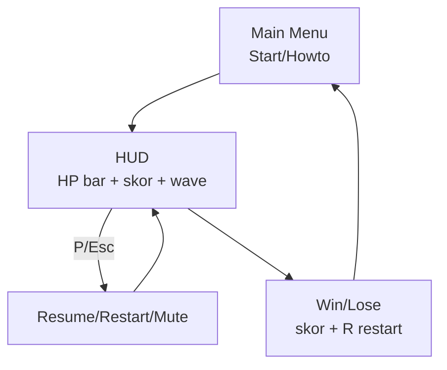

# HUD, Menu & Pause

## Learning Objectives

Setelah lesson ini user mampu:

- Membuat HUD (HP, skor, nyawa) yang terbaca 3 detik
- Membuat Main Menu, Pause, Settings volume
- Menerapkan UI state yang sinkron dengan game state

## Concept

UI = **baca (HUD) + aksi (menu) + umpan balik (transisi)**. Aturan 3 detik: pemain paham HP/skor/tujuan dalam 3 detik tanpa bertanya. Menu = state (`menu|playing|paused|over`) + overlay, bukan scene terpisah untuk MVP. Fleksibel: 1 komponen overlay dipakai ulang.

## Why It Matters

Game bagus dengan HUD berantakan = pemain tidak tahu menang/kalah. Menu 10 detik membingungkan = uninstall sebelum main.

## Visual Explanation



## Example

```ts
// UI state sinkron game state — 1 sumber kebenaran
type UIState = 'menu'|'playing'|'paused'|'over';
let ui: UIState = 'menu';

function drawHUD(ctx: CanvasRenderingContext2D, hp: number, max: number, score: number) {
  // bar HP: merah→kuning→hijau + angka (aksesibel, bukan warna saja)
  ctx.fillStyle = '#222'; ctx.fillRect(12, 12, 200, 18);
  const r = hp / max;
  ctx.fillStyle = r > 0.5 ? '#4ade80' : r > 0.25 ? '#facc15' : '#ef4444';
  ctx.fillRect(12, 12, 200 * r, 18);
  ctx.fillStyle = '#fff'; ctx.font = '14px sans-serif';
  ctx.fillText(`HP ${hp}/${max}   Score ${score}`, 12, 48);
}

function onKey(code: string) {
  if (code === 'Enter' && ui === 'menu') ui = 'playing';
  if ((code === 'KeyP' || code === 'Escape') && ui === 'playing') ui = 'paused';
  else if ((code === 'KeyP' || code === 'Escape') && ui === 'paused') ui = 'playing';
  if (code === 'KeyR' && ui === 'over') restart();
}
// update() hanya jalan saat ui==='playing'; render selalu jalan + overlay sesuai ui
```

Settings minimal: M mute, slider volume via `gain.value`. Simpan `muted` di localStorage.

## AI Coding with OpenCode

Minta AI buat UI overlay tanpa mencampur logika game.

## Example Prompt

```text
You are a senior frontend game developer.
Context: @src/main.ts game jalan tapi tanpa menu (langsung main). Ada gameState.
Task: Tambahkan src/ui.ts: menu/pause/over overlay + HUD + M mute + R restart. Dengar event.
Constraints: Jangan ubah combat/fisika. Canvas saja, tanpa DOM framework.
Acceptance Criteria: tsc lolos, alur menu→main→pause→over→restart jalan keyboard saja.
```

## Practical Exercise

Tambahkan "How to play" 3 baris di menu (gerak, serang, menang). Test ke 1 orang: paham dalam 10 detik?

## Challenge

Tambahkan responsive: canvas scale ikut layar (`resize` + `devicePixelRatio`), HUD tetap terbaca di 360px. Tambahkan kontras + ukuran font minimal 14px.

## Common Mistakes

- HUD kecil + transparan → tidak terbaca saat ramai.
- Pause tidak hentikan audio/timer → musuh jalan saat pause.
- Menu hanya mouse → tidak bisa keyboard/enter.

## Debugging

Input tembus saat pause/menu (klik mulai malah menembak)? Guard: `if (ui!=='playing') return` di semua aksi game. Pisahkan `onUIKey` vs `onGameKey`.

## Summary

Satu state UI + HUD 3-detik + pause benar + keyboard penuh = game terasa profesional.

## Next Lesson

→ `02-dialogue-quest-ui.md` — Dialogue & Quest UI.
