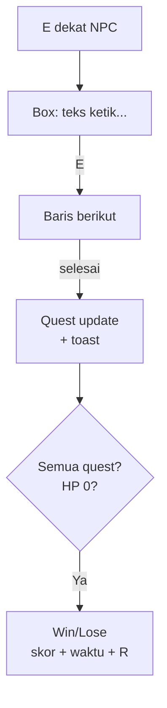

# Dialogue, Quest UI & End Screens

## Learning Objectives

Setelah lesson ini user mampu:

- Membuat dialogue box typewriter + pilihan
- Menampilkan quest tracker + notifikasi selesai
- Membuat layar Win/Lose yang jelas + ajakan main lagi

## Concept

Dialogue = **teks bertahap + maju (E/klik) + pilihan 1-2**. Quest UI = **tracker kiri (maks 3 aktif) + toast saat selesai**. End screen = **hasil + statistik + 1 tombol utama** (Main Lagi). Fleksibel: semua cukup data JSON, tanpa engine dialog.

## Why It Matters

Cerita bagus dengan UI buruk = pemain skip. End screen jelas = retensi + replay.

## Visual Explanation



## Example

```ts
// dialogue data-driven
type Line = { who: string; text: string };
const DIALOGS: Record<string, Line[]> = {
  elder: [
    { who: 'Elder', text: 'Slime menyerang desa. Kalahkan 3!' },
    { who: 'Kamu', text: 'Siap. Ke mana?' },
    { who: 'Elder', text: 'Ke timur. Kembali setelah selesai.' },
  ],
};
const dlg = { open: false, lines: [] as Line[], i: 0, chars: 0 };
function openDialog(id: string) { dlg.open = true; dlg.lines = DIALOGS[id]; dlg.i = 0; dlg.chars = 0; }
function updateDialog(dt: number) {
  if (!dlg.open) return;
  dlg.chars = Math.min(dlg.lines[dlg.i].text.length, dlg.chars + dt * 30);
}
function advanceDialog() {
  const line = dlg.lines[dlg.i];
  if (dlg.chars < line.text.length) { dlg.chars = line.text.length; return; } // E pertama: lengkapi
  dlg.i++;
  if (dlg.i >= dlg.lines.length) { dlg.open = false; bus.emit('talk', { npc: 'elder' }); }
  else dlg.chars = 0;
}

// quest tracker: gambar maks 3, toast 2.5 dtk
function drawQuests(ctx: CanvasRenderingContext2D, quests: {title:string;have:number;need:number;done:boolean}[]) {
  ctx.font = '13px sans-serif';
  quests.filter(q => !q.done).slice(0,3).forEach((q,i) => {
    ctx.fillStyle = 'rgba(0,0,0,.55)'; ctx.fillRect(12, 64+i*22, 220, 20);
    ctx.fillStyle = '#fff'; ctx.fillText(`${q.title} ${q.have}/${q.need}`, 18, 78+i*22);
  });
}
```

End screen: judul besar (MENANG/KALAH) + skor + waktu + best (localStorage) + `[R] Main lagi  [M] Menu`. Satu tombol utama ter-highlight.

## AI Coding with OpenCode

Minta AI buat dialogue + quest UI dari data tanpa ubah quest logic.

## Example Prompt

```text
You are a senior game UI developer.
Context: @src/quest.ts quest sudah jalan (event). Belum ada UI dialog.
Task: Buatkan src/dialog-ui.ts: openDialog/updateDialog/draw + quest tracker + toast + win/lose screen.
Constraints: Data dari quest.ts. Canvas saja. Font min 13px.
Acceptance Criteria: tsc lolos, dialog E maju, quest update realtime, end screen R restart.
```

## Practical Exercise

Tulis 1 dialog 3 baris untuk NPC-mu. Test: bisa maju dengan E dan klik? Game pause saat dialog terbuka?

## Challenge

Tambahkan pilihan: `[1] Terima quest  [2] Tolak`. Tolak → NPC beri hint lain. Simpan pilihan di save.

## Common Mistakes

- Teks full langsung → pemain skip. Wajib typewriter + E.
- Quest list 10 item → penuh layar. Maks 3 + sisanya di menu.
- End screen tanpa statistik → tidak ada kebanggaan/replay.

## Debugging

Dialog tidak maju? Cek input ganda (E juga dipakai serang) → saat `dlg.open`, alihkan E ke `advanceDialog` saja. Toast tidak hilang? Timer pakai dt, bukan frame count.

## Summary

Ketik bertahap + tracker ramping + end screen 1-aksi = cerita tersampaikan tanpa mengganggu main.

## Next Lesson

→ `09-ai-workflow/01-gdd-to-code.md` — GDD ke Kode dengan AI.
