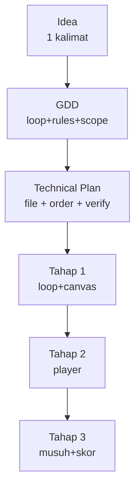

# Dari GDD ke Kode dengan AI

## Learning Objectives

Setelah lesson ini user mampu:

- Menulis GDD 1 halaman yang bisa dieksekusi AI
- Memecah GDD jadi Technical Plan bertahap
- Menjalankan 1 tahap kecil dengan acceptance jelas

## Concept

Alur fleksibel: **Idea (1 kalimat) → GDD (1 halaman) → Technical Plan (file + urutan) → Implement 1 tahap → Run**. AI bagus di tiap panah, buruk jika panah dilompati. Kunci: 1 prompt = 1 panah.

## Why It Matters

"Buatkan gamenya" → 800 baris ngawur. GDD→Plan→Tahap1 → 60 baris benar + bisa lanjut.

## Visual Explanation



## Example

GDD 1 halaman (contoh):

```text
Judul: Slime Hunt (top-down 1 arena)
Core loop: gerak → kalahkan 5 slime → ambil coin → upgrade HP/atk → wave berikutnya.
Rules: HP 100, potion heal 30, mati = restart wave. Menang wave 3 = win.
MVP: 1 arena, 1 musuh, 1 NPC, 2 quest, save. Later: boss, 3 arena, shop.
Rasa: gerak 260px/s, hit + knockback + partikel, SFX beep/boom.
```

Technical Plan (minta AI buat seperti ini):

```text
Files: main.ts, config.ts, player.ts, enemy.ts, ui.ts, save.ts
Order: 1) loop+canvas 2) player+input 3) enemy+collision 4) combat+skor 5) UI+save
Verify tiap tahap: tsc + 60 dtk main tanpa error.
```

Prompt tahap (contoh):

```text
Context: @AGENTS.md @src/main.ts (loop ada).
Task: Tahap 2 saja: player top-down WASD + clamp arena.
Acceptance: tsc lolos, gerak 260px/s konsisten, diagonal tidak lebih cepat.
```

## AI Coding with OpenCode

Pola OpenCode: `/init` → tempel GDD → "Buatkan Technical Plan saja" → setujui → "Implement tahap 1 saja" → run → commit → tahap 2.

## Example Prompt

```text
You are a senior game developer + planner.
Context: GDD Slime Hunt di atas. Repo kosong, TS+Canvas, max 8 file.
Task: Buatkan Technical Plan saja (belum kode): daftar file, isi tiap file, urutan 5 tahap, cara verifikasi.
Constraints: Tanpa engine. MVP saja.
Acceptance Criteria: Saya bisa jalankan tahap 1 tanpa bertanya lagi.
```

## Practical Exercise

Tulis GDD 1 halaman untuk game-mu (core loop + 3 rules + MVP vs Later). Minta AI ubah jadi Technical Plan 5 tahap.

## Challenge

Buat `AGENTS.md` 10 baris: stack, cara run, gaya kode, larangan, cara verifikasi. Ini membuat semua prompt berikutnya 2x lebih akurat.

## Common Mistakes

- GDD 5 halaman → tidak pernah dikode. 1 halaman cukup.
- Plan + kode sekaligus → AI skip verifikasi.
- Tidak commit per tahap → susah rollback saat tahap 4 merusak tahap 1.

## Debugging

AI keluar jalur? Hentikan, kecilkan: "Hanya tahap 2. Jangan sentuh file lain. Tampilkan diff." Tempel error log asli + 2 file terkait.

## Summary

GDD ramping + plan bertahap + 1 tahap sekali + verifikasi = AI dapat diandalkan untuk game utuh.

## Next Lesson

→ `02-debug-polish.md` — Debug & Polish dengan AI.
