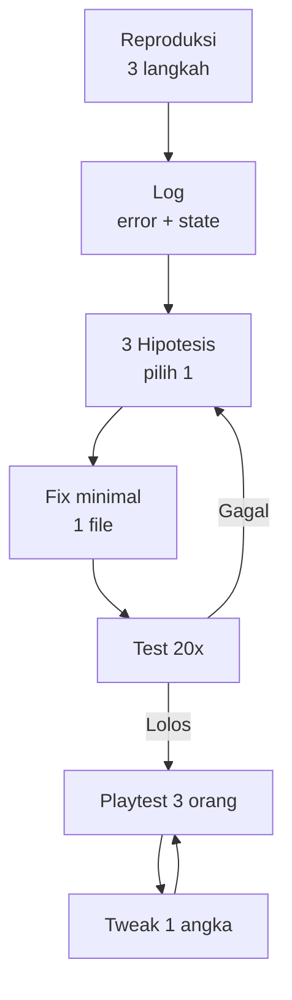

# Debug & Polish dengan AI

## Learning Objectives

Setelah lesson ini user mampu:

- Menjalankan loop debug: reproduksi → log → hipotesis → fix minimal → test
- Meminta AI diagnosis (bukan langsung fix)
- Mem-polish dari feedback playtest jadi tweak terkecil

## Concept

Debug = **perkecil + buktikan**, bukan tebak. Polish = **ukur + tweak 1 angka + test lagi**. AI membantu jika diberi: langkah reproduksi, log, file terkait, dan diminta 3 hipotesis dulu. Fleksibel untuk bug apapun.

## Why It Matters

80% waktu game dev = debug + polish, bukan fitur baru. Sistem ini yang membedakan game selesai vs game mangkrak.

## Visual Explanation



## Example

Template laporan bug (tempel ke AI):

```text
Bug: player kadang double-jump setelah jatuh dari tepi.
Repro: 1) lari ke tepi 2) jatuh 3) tekan jump 2x cepat → kadang bisa 2x.
Log: grounded=false, coyote=0.02, buffer=0.1 saat kejadian.
Files: @src/player.ts @src/physics.ts.
Task: Beri 3 hipotesis + pilih 1 + fix minimal.
```

Template polish dari feedback:

```text
Feedback: "wave 2 terlalu sulit, bola terlalu cepat."
Data: 3/5 tester kalah <30 dtk, skor rata-rata 200.
Task: Usulkan 1 tweak terkecil (angka) + cara ukur sukses.
```

Perintah fleksibel: "Jangan refactor. Tampilkan diff. Jelaskan kenapa fix ini, bukan yang lain."

## AI Coding with OpenCode

Dua mode: **Doctor** (diagnosis) lalu **Surgeon** (fix). Jangan gabung.

## Example Prompt

```text
You are a senior game debugger.
Context: @src/player.ts @src/physics.ts. Bug double-jump di atas. Log terlampir.
Task: Diagnosis saja: 3 hipotesis terurut + bukti yang perlu saya tambah (log apa?).
Constraints: Belum kirim fix.
Acceptance Criteria: Saya tahu log tambahan apa untuk memastikan hipotesis #1.
```

Lalu:

```text
Hipotesis #1 benar (coyote tidak reset). Fix minimal di player.ts saja.
Acceptance: 20x percobaan tidak ada double-jump, jump normal tetap enak.
```

## Practical Exercise

Ambil 1 bug-mu. Tulis repro 3 langkah + tempel log + minta 3 hipotesis. Tambahkan log yang diminta AI, ulangi.

## Challenge

Siapkan playtest 5 menit: 3 pemain, catat detik bosan/mati/bingung. Ubah 1 angka (speed/hp/interval), test lagi. Catat delta-nya.

## Common Mistakes

- "Perbaiki ini" tanpa repro/log → AI menebak 3 file.
- Fix 5 file sekaligus → bug baru 2.
- Polish = tambah fitur. Seharusnya: juice + 1 angka dulu.

## Debugging

AI fix merusak lain? `git diff` + `git stash` → test tahap per tahap. Minta AI tulis test manual 5 langkah agar tidak terulang.

## Summary

Repro + log + hipotesis + fix kecil + test ulang + tweak 1 angka = game stabil dan fun tanpa begadang.

## Next Lesson

→ `10-projects/project-02.md` — Project 02: Adventure 2D.
