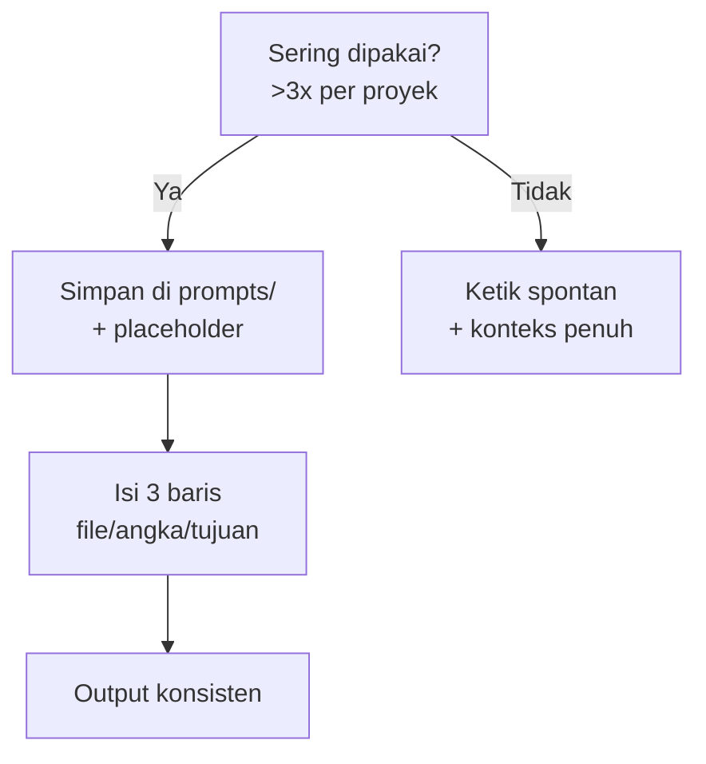

# Pustaka Prompt Proyek

## Learning Objectives

Setelah lesson ini user mampu:

- Menyusun folder `prompts/` berisi cetakan siap pakai per proyek
- Memutuskan kapan prompt disimpan vs diketik spontan
- Memakai prompt tersimpan agar gaya permintaan konsisten

## Concept

Prompt yang sering dipakai (scaffolding, tambah fitur, audit, review) layak disimpan sebagai file — seperti snippet kode. Prompt sekali pakai (debug spesifik) cukup diketik. Pustaka = **konsistensi**: AI menerima format sama tiap kali, output makin dapat diprediksi.

## Why It Matters

Mengetik ulang prompt panjang tiap sesi = boros + tidak konsisten. Pustaka 5 file menghemat 15 menit per sesi dan membuat Tanya AI di aplikasi ini pun lebih tajam.

## Visual Explanation



```svg-anim
nodes: [Tugas berulang, Pustaka, Isi 3 baris, Output konsisten]
flow: Tugas berulang -> Pustaka -> Isi 3 baris -> Output konsisten
highlight: Pustaka
```

## Example

Struktur `prompts/` minimal:

```text
game/
├── prompts/
│   ├── 01-scaffold.md    # struktur + loop + AGENTS.md
│   ├── 02-feature.md      # tambah 1 fitur (pola Code)
│   ├── 03-audit-dt.md     # audit semua gerakan tanpa * dt
│   ├── 04-enemy.md        # tambah tipe musuh via config
│   └── 05-balance.md      # 1 tweak + metrik proyek ini
```

Contoh isi `02-feature.md` (dengan placeholder `[...]`):

```text
You are a senior game developer.
Context: @[FILE_UTAMA] ([APA_YANG_SUDAH_JALAN]).
Task: [SATU_FITUR] dengan [DETAIL_ANGKA].
Constraints: Hanya ubah [FILE_YANG_BOLEH]. Tanpa lib baru.
Acceptance Criteria: [CARA_VERIFIKASI].
```

Dipakai:

```text
Context: @src/player.ts (gerak WASD 260px/s jalan).
Task: Dash (Shift): burst 600px/s 0.15 dtk, cooldown 1 dtk.
Constraints: Hanya player.ts. Tanpa lib baru.
Acceptance Criteria: tsc lolos, tidak tembus wall saat dash.
```

## AI Coding with OpenCode

Minta AI membuatkan pustaka awal dari riwayat prompt-mu: "Dari 10 prompt terakhir saya, mana yang berulang? Buatkan 4 file prompts/ untuk itu."

## Example Prompt

```text
You are a senior game developer.
Context: Proyek Slime Hunt, TS+Canvas, 10 file. Saya sering minta: tambah fitur, audit dt, tuning balance.
Task: Buatkan prompts/02-feature.md, 03-audit-dt.md, 05-balance.md sesuai pola lesson ini.
Constraints: Placeholder jelas dengan [KURUNG]. Tanpa kode game.
Acceptance Criteria: Saya bisa pakai ketiganya tanpa edit selain isi placeholder.
```

## Practical Exercise

Buat 1 file `prompts/02-feature.md` untuk proyekmu. Pakai 2x minggu ini, perbaiki placeholder yang membingungkan.

## Challenge

Tambahkan `prompts/06-review.md` (pola Review: kritik core loop sebagai playtester) + jadwal: review tiap milestone M2/M4/M6.

## Common Mistakes

- Menyimpan 20 prompt yang dipakai 1x (sampah).
- Placeholder kabur (`[konteks]` tanpa contoh isi).
- Pustaka tidak pernah diperbarui setelah arsitektur berubah.

## Debugging

Prompt tersimpan hasilnya menurun? Biasanya arsitektur berubah (nama file/bus/event beda) tapi prompt masih merujuk yang lama. Audit pustaka tiap ganti fase proyek.

## Summary

Sering dipakai → simpan + placeholder jelas → isi 3 baris tiap pakai. Pustaka kecil yang hidup mengalahkan koleksi besar yang basi.

## Next Lesson

→ `10-projects/project-02.md` — Project 02. Pustaka ini menemanimu di tiap milestone-nya.
