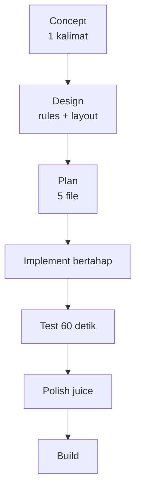

# Project 01 — Breakout Clone

## Learning Objectives

Setelah project ini user mampu:

- Membangun game lengkap playable 60 detik
- Menerapkan loop + dt + input + AABB + UI + SFX sederhana
- Melakukan iterasi debug + polish dengan AI

## Concept

Bangun **Breakout MVP**: paddle, bola, 3 baris bata, skor, 3 nyawa, win/lose. Fokus selesai, bukan sempurna.



## Why It Matters

Satu game kecil selesai > 5 tutorial setengah jalan. Di sini semua lesson bertemu.

## Brief

- **Judul:** Neon Breakout
- **Core loop:** Pantul bola → hancurkan bata → kejar combo → selamatkan bola.
- **Rules:** Bola jatuh = nyawa -1. 0 nyawa = game over. Semua bata hancur = win. Combo reset saat kena paddle.
- **Scope lock:** 1 level, 24 bata, tanpa power-up di MVP (power-up = challenge).

## Feature List (MVP)

- [ ] Canvas 800x600 + loop dt + FPS
- [ ] Paddle (mouse + keyboard A/D)
- [ ] Bola (launch dengan Space, pantul paddle/wall/bata)
- [ ] Bata 8x3 + HP 1 + skor + combo
- [ ] HUD (skor, nyawa, combo) + GameOver/Win overlay + restart (R)
- [ ] SFX WebAudio (beep pantul, boom hancur) tanpa file eksternal

## Technical Requirements

- TypeScript strict, tanpa engine, max ~6 file: `main.ts`, `paddle.ts`, `ball.ts`, `bricks.ts`, `physics.ts`, `ui.ts`, `audio.ts` (boleh gabung).
- Semua gerakan `* dt`, collision AABB split-axis.
- `tsc` lolos, 60fps di laptop standar.

## Folder Structure

```text
breakout/
├── index.html
├── src/main.ts
├── src/paddle.ts
├── src/ball.ts
├── src/bricks.ts
├── src/physics.ts
├── src/ui.ts
└── src/audio.ts
```

## Development Milestones

1. **M1 Loop+Canvas** (30 mnt): canvas + dt + FPS. Verify: kotak bergerak 300px/s.
2. **M2 Paddle** (30 mnt): mouse+keyboard. Verify: tidak keluar layar.
3. **M3 Ball** (60 mnt): launch + pantul wall/paddle. Verify: 20 pantulan tanpa tembus.
4. **M4 Bricks+Collision** (90 mnt): hancur + skor + combo. Verify: semua bata bisa hancur.
5. **M5 UI+Audio** (60 mnt): HUD + overlay + beep. Verify: win/lose + restart jalan.
6. **M6 Polish** (60 mnt): partikel + shake + pitch combo. Playtest 3 orang.

## OpenCode Prompts (jalankan satu per satu)

```text
1. Scaffolding: "Context: folder kosong, target TS+Canvas. Task: scaffolding breakout (index.html+src/main.ts loop+dt). Acceptance: canvas tampil."
2. Paddle: "Context: @src/main.ts. Task: tambah paddle mouse+keyboard, clamp layar. Acceptance: tidak keluar layar."
3. Ball: "Context: @src/main.ts @src/paddle.ts. Task: bola + launch Space + pantul. Acceptance: 20 pantulan stabil."
4. Bricks: "Context: @src/*.ts. Task: bricks 8x3 + AABB + skor/combo. Acceptance: semua bata hancur, combo reset benar."
5. UI/Audio: "Context: @src/*.ts. Task: HUD + overlay + WebAudio beep. Acceptance: win/lose/restart jalan."
```

## Challenges

- Power-up jatuh (E=expand, M=multiball, S=slow).
- Boss bar tiap 3 level / level generator.
- High score di localStorage.

## Acceptance Criteria

- [ ] Dimainkan 60 detik tanpa error console
- [ ] Bola tidak tembus paddle/wall/bata pada 60fps
- [ ] Skor + combo + nyawa benar
- [ ] Win saat bata habis, game over saat nyawa 0, R restart
- [ ] Orang lain paham cara main dalam 10 detik

## Common Mistakes

Minta AI "buatkan semuanya sekaligus" → debug neraka. Kerjakan M1→M6 berurutan, commit tiap milestone.

## Next

→ Project 02 (Adventure 2D: player, enemy, HP, inventory, NPC, quest, save) — buka setelah Project 01 selesai + dipolish.
