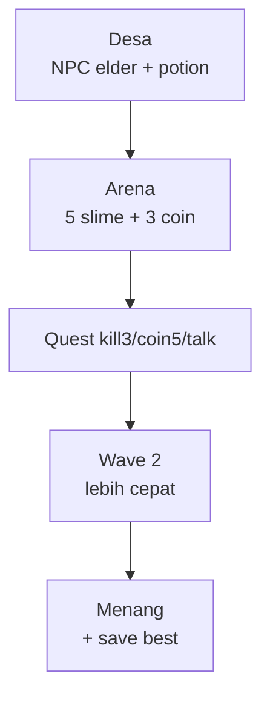

# Project 02 — 2D Adventure Mini

## Learning Objectives

Setelah project ini user mampu:

- Membangun adventure top-down lengkap: gerak, combat, NPC, quest, save
- Menggabungkan 18 lesson sebelumnya jadi 1 game
- Melakukan playtest + balancing + build

## Concept

Perluas Breakout mindset ke dunia: **1 desa + 1 arena**, bukan open world. Fleksibel: bisa top-down (lebih mudah, tanpa gravity) atau platformer (pakai physics jump). Pilih satu, kunci scope.



## Why It Matters

Project ini bukti semua lesson: loop + dt + input + collision + combat + AI + spawn + quest + save + HUD + dialog + juice + balancing.

## Brief

- **Judul:** Slime Hunt Mini
- **Core loop:** Jelajah → kalahkan slime → kumpulkan coin → selesaikan quest → upgrade → wave berikutnya.
- **Rules:** HP 100, potion +30, mati = restart wave (coin tersimpan). Menang = selesaikan 3 quest + wave 2.
- **Scope lock:** 2 map kecil, 2 tipe musuh max, 3 quest, 1 NPC. Boss = challenge, bukan MVP.

## Feature List (MVP)

- [ ] Top-down WASD + panah + touch opsional, diagonal normalize, 260px/s
- [ ] Slime patrol/chase/attack + Bat cepat (config)
- [ ] Attack J/klik: hitbox 0.12 dtk, dmg 10, knockback, iframes 0.5
- [ ] Coin pickup + skor + combo pitch
- [ ] NPC elder: dialog 3 baris + quest kill3
- [ ] Quest tracker (maks 3) + toast + reward
- [ ] Save/load localStorage berversi + autosave 10 dtk
- [ ] HUD + menu/pause/over + M mute + R restart
- [ ] Juice: partikel + shake + beep/boom
- [ ] 2 wave dengan BALANCE terpusat

## Technical Requirements

- TS strict, Canvas, ~10 file max: `main, config, input, physics, player, enemy, combat, quest, save, ui, audio, juice, anim`.
- Semua gerak `* dt`, AABB, event bus untuk quest/UI/SFX.
- `tsc` lolos, 60fps, save <1KB.

## Folder Structure

```text
slime-hunt/
├── index.html
├── AGENTS.md
├── src/main.ts
├── src/config.ts
├── src/input.ts
├── src/physics.ts
├── src/player.ts
├── src/enemy.ts
├── src/combat.ts
├── src/quest.ts
├── src/save.ts
├── src/ui.ts
├── src/dialog-ui.ts
├── src/audio.ts
└── src/juice.ts
```

## Development Milestones (fleksibel: boleh lompat, tapi verifikasi tiap tahap)

1. **M1 Dunia+gerak** (60 mnt): arena + desa + player gerak + kamera ikut. Verify: tidak keluar batas, diagonal normal.
2. **M2 Musuh** (90 mnt): slime AI + collision. Verify: patrol/chase/attack jelas + telegraph.
3. **M3 Combat+coin** (90 mnt): serang + damage + pickup + skor. Verify: 5 kill tanpa tembus/skip.
4. **M4 NPC+quest+save** (90 mnt): dialog + 3 quest + save/load. Verify: reload lanjut, save korup aman.
5. **M5 UI+juice+balance** (90 mnt): HUD/menu/pause + partikel/suara + 2 wave. Verify: 3 playtester menang wave1 <90 dtk.
6. **M6 Polish+build** (60 mnt): hit-stop, flash, best score, `npm run build`. Verify: 60 dtk tanpa error console.

## OpenCode Prompts (satu per milestone)

```text
1. "Context: folder kosong + GDD di atas. Task: scaffolding + tahap M1 saja. Acceptance: player gerak 260px/s."
2. "Context: @src/main.ts @src/player.ts. Task: M2 slime AI state machine. Acceptance: tidak serang luar layar."
3. "Context: @src/*.ts. Task: M3 combat+coin. Acceptance: iframes benar, skor benar."
4. "Context: @src/events.ts. Task: M4 quest+save berversi. Acceptance: reload lanjut."
5. "Context: @src/*.ts. Task: M5 UI+juice+balance 2 wave. Acceptance: playtest 3 orang."
```

Lihat lesson `09-ai-workflow/` untuk pola GDD→Plan→Tahap dan Debug.

## Challenges

- Boss slime besar tiap wave 3 (HP 100, 2 serangan).
- Shop: coin → beli pedang (+5 atk) / hati (+20 max HP).
- 3 arena + pintu teleport.

## Acceptance Criteria

- [ ] 5 menit main tanpa error
- [ ] 3 quest selesai + reward benar
- [ ] Reload lanjut progres; save korup tidak crash
- [ ] Orang baru paham dalam 30 detik
- [ ] `npm run build` sukses

## Next

→ Project 03 (bebas: RPG / roguelike / tower defense) setelah Project 02 dipolish + 1 playtest luar.
