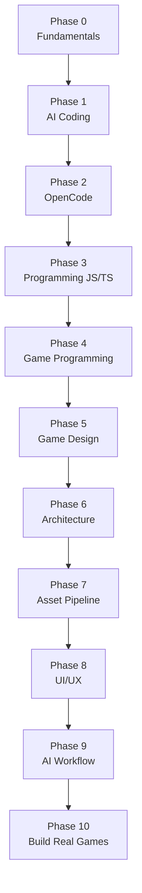
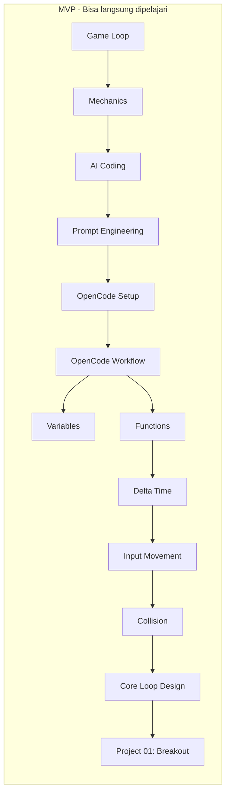

# Roadmap Pembelajaran



## Jalur MVP (yang sudah tersedia di repo ini)



## Workflow Standar Tiap Lesson

```text
Idea → Game Design → Technical Plan → Project Structure
 → Implementation → Run → Test → Debug → Refactor → Polish → Build
```

## Estimasi Waktu MVP

| Phase | Lesson | Estimasi |
|-------|--------|----------|
| 0 Fundamentals | 3 | 1.5 jam |
| 1 AI Coding | 2 | 1 jam |
| 2 OpenCode | 2 | 1.5 jam |
| 3 Programming | 2 | 2 jam |
| 4 Game Programming | 3 | 3 jam |
| 5 Game Design | 1 | 45 mnt |
| 10 Project 01 | 1 | 4-6 jam |
| **Total MVP** | **14** | **~14 jam** |
