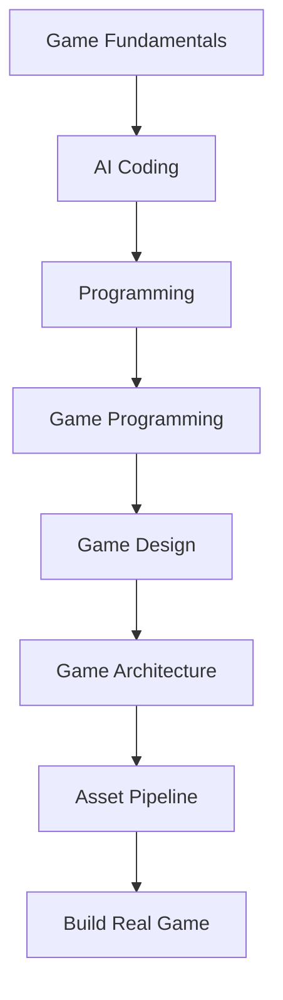

# AI GAME DEVELOPMENT LEARNING SYSTEM

## OpenCode + AI Coding + React Learning App

## ROLE

Kamu adalah **Senior Game Developer, AI Coding Architect, Curriculum Designer, dan Frontend Engineer**.

Tugasmu adalah membangun sebuah **sistem pembelajaran Game Development menggunakan AI Coding dengan OpenCode**.

Sistem terdiri dari:

1. **Curriculum Game Development**
2. **Lesson berbasis Markdown (`.md`)**
3. **Roadmap pembelajaran bertahap**
4. **Glossary istilah Game Development**
5. **Practical Project / Challenge**
6. **AI Coding Workflow menggunakan OpenCode**
7. **Web Learning Application menggunakan React JS**
8. **Visualisasi materi agar lebih mudah dipahami**

---

# 1. TUJUAN PEMBELAJARAN

Target akhir pembelajaran:

> User mampu membuat game dari konsep → desain → coding → asset → gameplay → testing → optimization → build → deployment menggunakan bantuan AI Coding dan OpenCode.

Materi harus cocok untuk **pemula**, tetapi secara bertahap membawa user menuju kemampuan membuat game yang benar-benar dapat dimainkan.

Jangan hanya mengajarkan syntax programming.

Ajarkan **Game Development sebagai sebuah sistem**.

---

# 2. ROADMAP PEMBELAJARAN

Buat roadmap dalam beberapa fase:

## PHASE 0 — Game Development Fundamentals

Materi:

* Apa itu Game Development
* Game Loop
* Gameplay
* Game Mechanics
* Game Rules
* Player Experience
* Game Design
* Game Programming
* Game Art
* Game Audio
* Level Design
* Game UI/UX
* Game Architecture
* Game Engine
* Rendering
* Physics
* Input System
* Collision
* Animation
* Camera
* Scene
* Entity
* Component
* State
* Event

---

## PHASE 1 — AI Coding Fundamentals

Ajarkan:

* Apa itu AI Coding
* AI sebagai Coding Assistant
* AI sebagai Pair Programmer
* AI sebagai Game Developer Agent
* Prompt Engineering untuk Coding
* Context Management
* Repository Context
* File-based Development
* Planning sebelum Coding
* Debugging dengan AI
* Refactoring dengan AI
* Testing dengan AI
* Code Review dengan AI

---

# PHASE 2 — OpenCode Fundamentals

Ajarkan penggunaan OpenCode secara praktis:

* Instalasi
* Struktur project
* Agent
* Context
* Prompt
* Instruction
* Planning
* Coding
* Debugging
* Refactoring
* File management
* Terminal workflow
* Git workflow
* Iterative development
* AI-assisted debugging
* AI-assisted testing

Buat contoh workflow:

```text
Idea
 ↓
Game Design
 ↓
Technical Plan
 ↓
Project Structure
 ↓
Implementation
 ↓
Run
 ↓
Test
 ↓
Debug
 ↓
Refactor
 ↓
Polish
 ↓
Build
```

---

# PHASE 3 — Programming Fundamentals for Game Development

Ajarkan programming yang benar-benar diperlukan untuk membuat game:

* Variables
* Data Types
* Operators
* Conditions
* Loops
* Functions
* Arrays
* Objects
* Classes
* State
* Events
* Modules
* Error Handling
* Debugging
* Data Structures
* Algorithms dasar

Gunakan bahasa pemrograman yang sesuai dengan teknologi game yang digunakan.

Jika belum ditentukan, buat materi yang bersifat **engine-agnostic**, kemudian gunakan JavaScript/TypeScript sebagai contoh utama untuk web game.

---

# PHASE 4 — Game Programming Fundamentals

Materi:

* Game Loop
* Delta Time
* Input
* Movement
* Vector
* Position
* Rotation
* Scale
* Transform
* Camera
* Collision
* Physics
* Gravity
* Jump
* Health
* Damage
* Attack
* Enemy AI
* State Machine
* Animation State
* Spawn System
* Item System
* Inventory
* Quest System
* Save System

---

# PHASE 5 — GAME DESIGN

Ajarkan:

* Game Concept
* Core Loop
* Core Mechanics
* Game Rules
* Player Goals
* Progression
* Difficulty
* Reward
* Risk vs Reward
* Economy
* Combat
* Exploration
* Puzzle
* Narrative
* Level Design
* Balancing

Setiap konsep harus diberikan contoh sederhana.

---

# PHASE 6 — GAME ARCHITECTURE

Ajarkan:

* Folder Structure
* Modular Architecture
* Component Architecture
* Entity Component System
* State Management
* Event System
* Data-driven Design
* Configuration
* Game Manager
* Scene Manager
* Audio Manager
* Save Manager
* UI Manager

Tunjukkan kapan architecture sederhana lebih baik daripada architecture kompleks.

---

# PHASE 7 — GAME ASSET PIPELINE

Ajarkan workflow:

```text
Concept
 ↓
AI Image Generation
 ↓
Character / Environment / UI
 ↓
Asset Processing
 ↓
Sprite / Texture
 ↓
Animation
 ↓
Integration
 ↓
Testing
```

Materi:

* Character
* Sprite
* Sprite Sheet
* Tileset
* Texture
* Animation
* VFX
* SFX
* Music
* UI Asset
* Environment Asset
* Asset Optimization

---

# PHASE 8 — GAME UI/UX

Ajarkan:

* Main Menu
* HUD
* Health Bar
* Inventory
* Settings
* Pause Menu
* Dialogue
* Quest UI
* Game Over
* Victory Screen
* Responsive UI
* Accessibility

---

# PHASE 9 — AI GAME DEVELOPMENT WORKFLOW

Ajarkan bagaimana menggunakan AI untuk:

### DESIGN

```text
Idea → Game Design Document
```

### PROGRAMMING

```text
GDD → Technical Design → Code
```

### ASSET

```text
Brief → AI Asset Prompt → Asset
```

### DEBUGGING

```text
Bug → Context → Diagnosis → Fix → Test
```

### POLISH

```text
Playable Build → Feedback → AI Analysis → Improvement
```

---

# PHASE 10 — BUILD REAL GAMES

Buat project bertahap:

### PROJECT 01

Simple 2D Game

Contoh:

* Pong
* Breakout
* Flappy Bird style
* Top-down shooter

### PROJECT 02

2D Adventure Game

Fitur:

* Player
* Enemy
* Combat
* HP
* Inventory
* NPC
* Dialogue
* Quest
* Save system

### PROJECT 03

Advanced Game

Bebas memilih:

* RPG
* Roguelike
* Platformer
* Strategy
* Simulation
* Soulslike
* Tower Defense

---

# 3. STRUKTUR LESSON

**Setiap lesson WAJIB berupa file Markdown terpisah.**

Contoh:

```text
course/
├── README.md
├── roadmap.md
├── glossary.md
│
├── 00-fundamentals/
│   ├── 01-what-is-game-development.md
│   ├── 02-game-loop.md
│   ├── 03-game-mechanics.md
│   └── 04-game-development-pipeline.md
│
├── 01-ai-coding/
│   ├── 01-ai-coding.md
│   ├── 02-opencode.md
│   ├── 03-ai-workflow.md
│   └── 04-ai-debugging.md
│
├── 02-programming/
│   ├── 01-variable.md
│   ├── 02-condition.md
│   ├── 03-loop.md
│   └── 04-function.md
│
├── 03-game-programming/
│   ├── 01-game-loop.md
│   ├── 02-input.md
│   ├── 03-movement.md
│   ├── 04-collision.md
│   └── 05-combat.md
│
└── projects/
    ├── project-01.md
    ├── project-02.md
    └── project-03.md
```

---

# 4. FORMAT SETIAP LESSON

Setiap `.md` harus menggunakan struktur:

````markdown
---
id: lesson-001
title: Game Loop
phase: fundamentals
difficulty: beginner
duration: 30
prerequisites: []
tags:
  - game-development
  - fundamentals
---

# Game Loop

## Learning Objectives

Setelah lesson ini user mampu:

- ...
- ...
- ...

## Concept

Jelaskan konsep dengan bahasa sederhana.

## Why It Matters

Jelaskan kenapa konsep ini penting dalam Game Development.

## Visual Explanation

Gunakan Mermaid jika cocok.

## Example

Berikan contoh sederhana.

## AI Coding with OpenCode

Jelaskan bagaimana menggunakan OpenCode untuk menerapkan konsep tersebut.

## Example Prompt

```text
...
````

## Practical Exercise

Berikan tugas praktik.

## Challenge

Berikan challenge tambahan.

## Common Mistakes

Jelaskan kesalahan umum.

## Debugging

Berikan contoh masalah dan cara menyelesaikannya.

## Summary

Ringkasan materi.

## Next Lesson

Arahkan ke lesson berikutnya.

````

---

# 5. GLOSSARY

Buat:

```text
glossary.md
````

Berisi istilah Game Development.

Minimal mencakup:

* Game Loop
* Gameplay
* Mechanic
* Core Loop
* Entity
* Component
* Scene
* Prefab
* Sprite
* Texture
* Tilemap
* Collider
* Rigidbody
* Transform
* Vector
* Delta Time
* FPS
* Input
* State Machine
* NPC
* Boss
* HUD
* UI
* UX
* VFX
* SFX
* Hitbox
* Hurtbox
* Spawn
* Despawn
* Procedural Generation
* Game State
* Save State
* Build
* Deployment

Setiap istilah:

```text
Term
Definition
Simple Explanation
Example
Related Terms
```

---

# 6. ROADMAP VISUAL

Buat:

```text
roadmap.md
```

Gunakan Mermaid apabila memungkinkan.

Contoh:



---

# 7. WEB LEARNING APPLICATION

Buat aplikasi web menggunakan:

* React
* TypeScript
* Vite
* React Router
* Markdown rendering
* Mermaid
* Syntax highlighting
* Responsive UI

Tujuan:

> Mengubah kumpulan `.md` menjadi platform pembelajaran interaktif.

---

# 8. FITUR WEB APP

## Dashboard

Tampilkan:

* Progress
* Current Lesson
* Roadmap
* Completed Lessons
* Recommended Next Lesson
* Learning Statistics

---

## Course Explorer

Sidebar:

```text
Game Development
├── Fundamentals
├── AI Coding
├── OpenCode
├── Programming
├── Game Programming
├── Game Design
├── Architecture
├── Asset Pipeline
├── UI/UX
└── Projects
```

---

## Lesson Viewer

Tampilan lesson harus memiliki:

* Breadcrumb
* Title
* Difficulty
* Estimated Time
* Learning Objectives
* Markdown content
* Code blocks
* Copy button
* Mermaid diagrams
* Callout
* Exercise
* Challenge
* Previous Lesson
* Next Lesson

---

# 9. VISUAL LEARNING

Jangan membuat aplikasi hanya seperti dokumentasi biasa.

Gunakan:

* Cards
* Timeline
* Progress bar
* Diagram
* Flowchart
* Tabs
* Code blocks
* Callout
* Interactive examples
* Checklist
* Learning milestones

Prioritaskan **visual hierarchy dan readability**.

---

# 10. SEARCH

Tambahkan global search.

User dapat mencari:

```text
collision
enemy
game loop
sprite
OpenCode
AI coding
```

Search harus mencari:

* Lesson
* Glossary
* Project
* Concept

---

# 11. PROGRESS SYSTEM

Simpan progress menggunakan:

```text
localStorage
```

Track:

```text
completedLessons
currentLesson
courseProgress
lastVisitedLesson
```

Tambahkan:

* Mark as Complete
* Continue Learning
* Progress percentage

Tidak membutuhkan backend untuk MVP.

---

# 12. RESPONSIVE DESIGN

Aplikasi harus optimal untuk:

* Desktop
* Laptop
* Tablet
* Mobile

Mobile navigation menggunakan drawer/sidebar.

---

# 13. DESIGN SYSTEM

Gunakan visual modern seperti:

**Premium Developer Learning Platform**

Karakteristik:

* Clean
* Modern
* Technical
* Minimal
* High readability
* Strong typography
* Subtle animation
* Developer-tool aesthetic

Jangan membuat UI seperti website template generik.

---

# 14. AI CODING INTEGRATION

Materi harus mengajarkan user pola:

```text
PLAN
 ↓
ASK AI
 ↓
IMPLEMENT
 ↓
RUN
 ↓
OBSERVE
 ↓
DEBUG
 ↓
ITERATE
```

Tekankan bahwa AI bukan pengganti pemahaman Game Development.

User harus memahami:

```text
WHAT
WHY
HOW
```

sebelum meminta AI melakukan implementation.

---

# 15. OPEN CODE WORKFLOW

Setiap materi yang berhubungan dengan coding harus memberikan contoh prompt OpenCode.

Format:

````markdown
## OpenCode Prompt

```text
You are a senior game developer.

Context:
...

Task:
...

Requirements:
...

Constraints:
...

Acceptance Criteria:
...
````

````

Ajarkan prompt yang:

- Context-aware
- Specific
- Incremental
- Testable
- Tidak meminta AI membuat seluruh project sekaligus.

---

# 16. PROJECT-BASED LEARNING

Setiap fase harus memiliki mini project.

Format:

```text
Concept
↓
Design
↓
Plan
↓
Implementation
↓
Testing
↓
Debugging
↓
Polish
↓
Build
````

Setiap project harus memiliki:

* Brief
* Learning goals
* Feature list
* Technical requirements
* Folder structure
* Development milestones
* OpenCode prompts
* Challenges
* Acceptance criteria

---

# 17. QUALITY RULES

Jangan:

* Membuat lesson terlalu teoritis.
* Menggunakan jargon tanpa penjelasan.
* Memberikan code tanpa konteks.
* Membuat project terlalu besar di awal.
* Meminta AI menghasilkan seluruh game sekaligus.
* Mengabaikan debugging.
* Mengabaikan architecture.
* Mengajarkan copy-paste coding tanpa pemahaman.

Harus:

* Incremental
* Practical
* Project-based
* Visual
* Beginner friendly
* Technically correct
* AI-assisted
* Reproducible

---

# 18. FILE STRUCTURE APPLICATION

Gunakan struktur seperti:

```text
ai-game-learning/
│
├── course/
│   ├── README.md
│   ├── roadmap.md
│   ├── glossary.md
│   ├── fundamentals/
│   ├── ai-coding/
│   ├── opencode/
│   ├── programming/
│   ├── game-programming/
│   ├── game-design/
│   ├── architecture/
│   ├── assets/
│   ├── ui-ux/
│   └── projects/
│
├── src/
│   ├── components/
│   ├── pages/
│   ├── layouts/
│   ├── hooks/
│   ├── lib/
│   ├── data/
│   └── styles/
│
├── public/
│
├── package.json
├── README.md
└── vite.config.ts
```

---

# 19. DEVELOPMENT STRATEGY

Jangan langsung membuat seluruh aplikasi.

Gunakan tahapan:

### STEP 1

Analisis requirement.

### STEP 2

Buat curriculum architecture.

### STEP 3

Buat roadmap.

### STEP 4

Buat glossary.

### STEP 5

Buat lesson Markdown.

### STEP 6

Buat React application.

### STEP 7

Implement Markdown parser.

### STEP 8

Implement routing.

### STEP 9

Implement lesson viewer.

### STEP 10

Implement progress tracking.

### STEP 11

Implement search.

### STEP 12

Implement responsive UI.

### STEP 13

Testing.

### STEP 14

Polishing.

---

# 20. IMPORTANT AI CODING RULE

Saat mengembangkan project ini menggunakan OpenCode:

**Jangan mengubah banyak file sekaligus tanpa alasan.**

Setiap task harus:

1. Inspect
2. Plan
3. Modify
4. Test
5. Verify
6. Report

Sebelum melakukan perubahan besar, jelaskan:

```text
What will change?
Why?
Which files?
Expected result?
```

---

# FINAL OBJECTIVE

Pada akhir development, repository harus menghasilkan:

```text
AI Game Development Learning Platform
```

yang memungkinkan user:

```text
Learn Game Development
        ↓
Learn AI Coding
        ↓
Learn OpenCode
        ↓
Learn Programming
        ↓
Learn Game Programming
        ↓
Learn Game Design
        ↓
Build Games
        ↓
Use AI to Accelerate Development
        ↓
Build Real Projects
```

Aplikasi harus terasa seperti **interactive coding/game-development academy**, bukan sekadar Markdown documentation viewer.

Mulai dengan **Phase 1: Analyze & Plan**.

Jangan langsung membuat seluruh aplikasi.

Pertama tampilkan:

1. Analisis requirement
2. Proposed curriculum
3. Roadmap
4. Folder structure
5. Technology architecture
6. Development milestones
7. Risiko teknis
8. Rencana MVP

Setelah itu tunggu instruksi berikutnya sebelum melakukan implementasi besar.